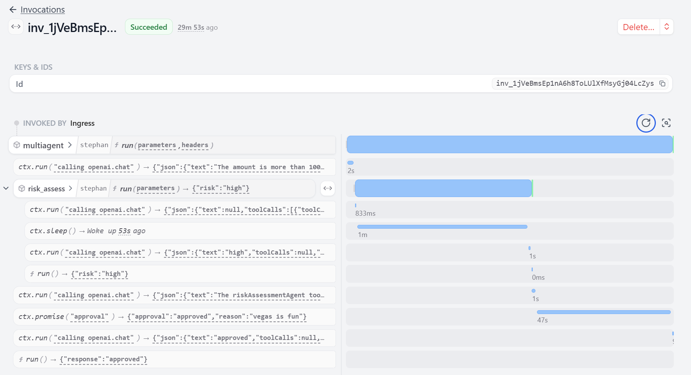

<!-- markdown-link-check-disable -->

<!-- markdown-link-check-enable -->

# Examples for AI workflows and Durable Agents

This repo contains a set of runnable examples of AI workflows and agents, using  **Durable Execution and Orchestration** via [Restate](https://restate.dev/) ([Github](https://restatedev/restate))

The goal is to show how you can easily add production-grade _resilience_, _state persistence_, _retries_, _suspend/resume_, _human-in-the-loop_, and _observability_ to agentic workflows. So you can ship agents that stay alive and consistent without sprinkling retry-code everywhere and without building heavyweight infra yourself.

The Restate approach works **independent of specific SDKs** but **integrates easily with popular SDKs**, like the [Vercel AI SDK](https://ai-sdk.dev/) or the [OpenAI Agent SDK](https://openai.github.io/openai-agents-python/). You can also use without and Agent SDK _(roll your own loop)_ or for more traditional workflows.

📄 A gentle intro is in [the blog post "Durable Agents - Fault Tolerance across Frameworks and without Handcuffs"](https://restate.dev/blog/durable-ai-loops-fault-tolerance-across-frameworks-and-without-handcuffs/)

### Restate + Vercel AI SDK

- **[ Template](vercel-ai/template)**
- [More examples (including Next.js, multi-agent, etc.)](vercel-ai/examples).

### Restate + OpenAI Agent SDK

- **[ Template](openai-agents/template)**
- [More examples (including handoffs, memory, etc.)](openai-agents/examples).

### Roll your own Loop? AI-enriched workflows?

Restate is a flexible general-purpose runtime for what we call _innately resilient application_. It is not limited to agentic workflow use cases and is being used for a variety of other use cases as well, including financial transactions or order processing. These examples show how to build agents directly on Restate's durable execution and state management:

- [Standalone Agent](advanced/restate-native-agent/)

## Use Cases

| Use Case                           | What it solves                                                                              |
| ---------------------------------- | ------------------------------------------------------------------------------------------- |
| **Durable Execution**              | Crash-safe LLM/tool calls & idempotent retries—agents resume at the last successful step.   |
| **Journal Observability**          | Auto-captured journal of every step, retry, and message for easy debugging and auditing.    |
| **Human-in-the-loop & long waits** | Suspend while waiting for user approval or slow jobs; pay for compute, not wall-clock time. |
| **Stateful sessions / memory**     | Virtual Objects keep multi-turn conversations and other state isolated and consistent.      |
| **Multi-agent orchestration**      | Reliable RPC, queuing, and scheduling between agents running in separate processes.         |

   
  Restate UI showing an ongoing agent execution

## Full Example Catalog

1. [**Restate + Vercel AI**](vercel-ai): 
   - [ Template](vercel-ai/template): A minimal example of how to use Restate with the Vercel AI SDK.
   - [ Examples](vercel-ai/examples): A more advanced example of how to use Restate with the Vercel AI SDK that can be deployed as a Next.js app on Vercel.
2. [**Restate + OpenAI Agents Python SDK**](openai-agents): 
   - [ Template](openai-agents/template): A minimal example of how to use Restate with the OpenAI Agents SDK.
   - [ Examples](openai-agents/examples): A more advanced example of how to use Restate with the OpenAI Agents SDK.
2. [**Patterns**](patterns) for hardening custom LLM orchestration logic.
   - [ Chaining LLM calls](patterns#chaining-llm-calls)
   - [ Parallelizing tool calls](patterns#parallelizing-tool-calls)
   - [ Dynamic routing based on LLM output](patterns#dynamic-routing-based-on-llm-output)
   - [ Orchestrator-worker](patterns#orchestrator-worker-pattern)
   - [ Evaluator-optimizer](patterns#evaluator-optimizer-pattern)
   - [ Human-in-the-loop](patterns#human-in-the-loop-pattern)
3. [**MCP** ](mcp): Using Restate for exposing tools and resilient orchestration of tool calls.
4. [**A2A**  ](a2a): Implement Google's Agent-to-Agent protocol with Restate as resilient, scalable task orchestrator.
5. [**Advanced examples**](end-to-end-applications): 
   - [ Restate-native agent](advanced/restate-native-agent/README.md): A fully customizable agent implemented with Restate without an Agent SDK. 
   - [ Interruptible agents](advanced/interruptible-agent/README.md): A customized agent with different operational modes to process new inputs: interrupting, incorporating, queueing.
   - [ Insurance claims](advanced/insurance-claims/README.md): Filing insurance claims by parsing PDF receipts with LLMs.

Restate currently supports 6 languages:

The examples can be translated to any of the supported languages. 
Join our [Discord](https://discord.gg/skW3AZ6uGd)/[Slack](https://join.slack.com/t/restatecommunity/shared_invite/zt-2v9gl005c-WBpr167o5XJZI1l7HWKImA) to get help with translating an examples to your language of choice.

## Learn more
- [Documentation](https://docs.restate.dev/)
- [Quickstart](https://docs.restate.dev/get_started/quickstart)
- [Tour of Restate: a tutorial including the most important features](https://docs.restate.dev/get_started/tour)
- [Examples on workflows, microservice orchestration, async tasks, event processing](https://github.com/restatedev/examples)
- [Restate Cloud](https://restate.dev/cloud/)
- [Discord](https://discord.gg/skW3AZ6uGd) / [Slack](https://join.slack.com/t/restatecommunity/shared_invite/zt-2v9gl005c-WBpr167o5XJZI1l7HWKImA)

## Acknowledgements

- The implementations of the Restate-native agent in this repo are heavily inspired by the [OpenAI Agents SDK](https://github.com/openai/openai-agents-python). We therefore want to give credit to the developers of this SDK for the great work they have done. This repo builds further on their work to make it benefit from Restate's programming model and capabilities.

- The DIY patterns are largely based on Anthropic's [agents cookbook](https://github.com/anthropics/anthropic-cookbook/tree/main/patterns/agents).

- Some of the A2A examples in this repo are based on the examples included in the [Google A2A repo](https://github.com/google/A2A/tree/main).
