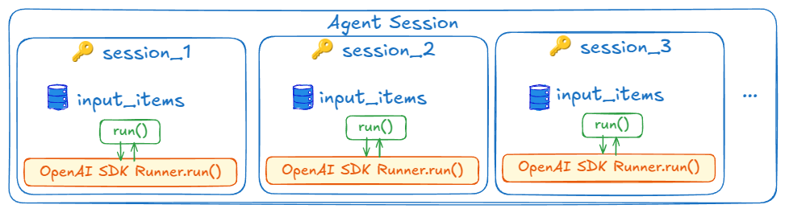
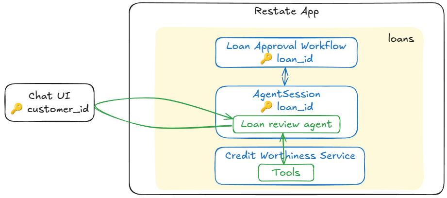
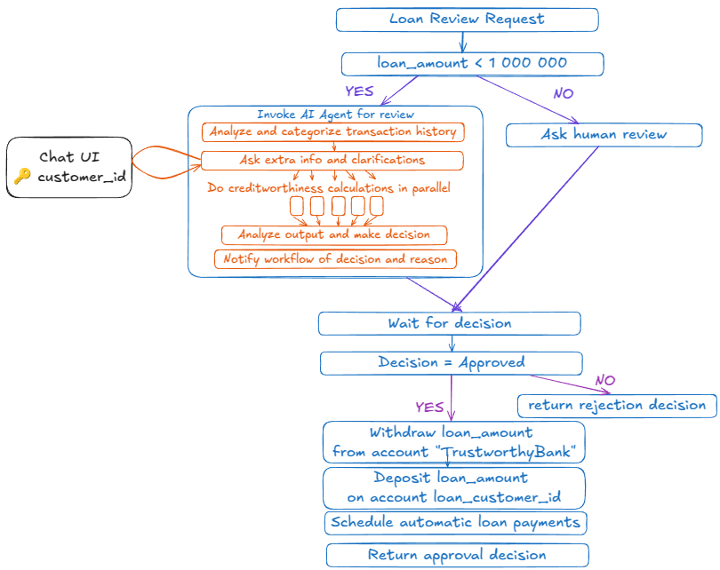
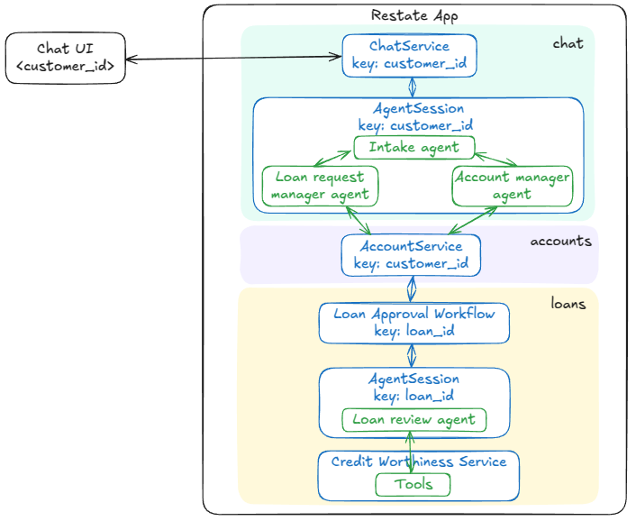

# Restate AI Agents examples

This repository contains examples of how to use Restate for LLM-based / AI Agent use cases.

Restate gives many benefits when implementing LLM-based applications and agents. 
In this ReadMe we describe a few options on how to integrate Restate with existing AI SDKs.

The integration goes from loose integration (calling LLMs or Agent SDKs from Restate actions) to tight integration (implementing long-running multi-agent setups with Restate constructs).

At this point, we see each of these proposed integrations as a valid way of using Restate for AI applications, depending on the use case and desired behavior. 

We are interested in understanding which of these appeals most to users.

The options:
1. [Using Restate for orchestrating LLM calls](https://github.com/restatedev/restate-ai-agents/tree/main?tab=readme-ov-file#using-restate-for-orchestrating-llm-calls)
2. [Using Restate for stateful, explicit control flow over LLM feedback loops](https://github.com/restatedev/restate-ai-agents/tree/main?tab=readme-ov-file#using-restate-for-stateful-explicit-control-flow-and-llm-feedback-loops) 
3. [Using Restate together with Agent SDKs for scalable, resilient agent loops](https://github.com/restatedev/restate-ai-agents/tree/main?tab=readme-ov-file#using-restate-together-with-agent-sdks-for-scalable-resilient-agent-loops)
4. [Using Restate for agentic workflows](https://github.com/restatedev/restate-ai-agents/tree/main?tab=readme-ov-file#using-restate-for-agentic-workflows)
5. [Mixing static, code-defined workflows with agentic workflows](https://github.com/restatedev/restate-ai-agents/tree/main?tab=readme-ov-file#mixing-static-code-defined-workflows-with-agentic-workflows)
6. [Long-lived multi-agent setups](https://github.com/restatedev/restate-ai-agents/tree/main?tab=readme-ov-file#long-lived-multi-agent-setups)


## Using Restate for orchestrating LLM calls

This example shows how to implement Anthropic's [agents cookbook](https://github.com/anthropics/anthropic-cookbook/tree/main/patterns/agents) patterns using Restate.

The patterns in this example show how you can use Restate to harden LLM-based routing decisions and tool executions with Restate.

The patterns included here:
- [Chaining LLM calls](a_orchestrating_llm_calls/a_chaining/chaining.py)
- [Parallelizing tool calls](a_orchestrating_llm_calls/b_parallelization/parallelization.py)
- [Dynamic routing based on LLM output](a_orchestrating_llm_calls/c_routing/routing.py)
- [Orchestrator-worker pattern](a_orchestrating_llm_calls/d_orchestrator_workers/orchestrator_workers.py)
- [Evaluator-optimizer pattern](a_orchestrating_llm_calls/e_evaluator_optimizer/evaluator_optimizer.py)

For example, parallelization in the orchestrator-worker pattern can be implemented as follows:
```python
tasks = await ctx.run("parse tasks", lambda: parse_tasks(tasks_xml))

# Process each task in parallel
futures = [ctx.run("process task", lambda task_info=task_info: llm_call(format_prompt(
        req.worker_prompt,
        original_task=req.task,
        task_type=task_info["type"],
        task_description=task_info["description"],
        **llm_context,
    ))) for task_info in tasks]
await restate.gather(*futures)
worker_responses = [await future for future in futures]
```

The benefits of using Restate here are:
- **Automatic retries** of failed tasks: LLM API down, timeouts, long-running tasks, infrastructure failures, etc.
- **Recovery of previous progress**: After a failure, Restate recovers the progress the execution did before the cash. 
It persists routing decisions, tool execution outcomes, and deterministically replays them after failures.
As opposed to executing all tasks again, Restate only re-executes the tasks that were not completed before the failure.
- **Management of the orchestration task and all parallel subtasks**: Restate guarantees all tasks run to completion exactly once.
- **Idempotency**: Restate can deduplicate requests and tool executions.

Note that this does not use an Agent SDK.
These patterns only use an SDK to help with calling the LLM: OpenAI Responses API, or Anthropic's API. 

## Using Restate for stateful, explicit control flow and LLM feedback loops 
You can integrate Restate one step deeper into your LLM-based apps by using Restate's stateful entities, called Virtual Objects, to manage the session state of the interactions with the LLM.

In the previous section, we talked about the evaluator-optimizer pattern which implements a loop of letting the LLM generate a response, and then asking the LLM to evaluate the response, then generate a new response based on the evaluation, and so on.
This is a feedback loop that can be used to improve the quality of the LLM's output.

Instead of letting another LLM do the evaluation, you can also ask a human to evaluate the output of the LLM.

In this example, we track the generated responses and the chain of thought in a Restate Virtual Object, and let the user repeatedly invoke the handler with new insights ([full code example](a_orchestrating_llm_calls/f_human_evaluator_optimizer/human_evaluator_optimizer.py))

```python
human_evaluator_optimizer = restate.VirtualObject("HumanEvaluatorOptimizer")


@human_evaluator_optimizer.handler()
async def run(ctx: restate.ObjectContext, req: MyRequest) -> tuple[str, list[dict]]:
    memory = await ctx.get("memory") or []
    chain_of_thought = await ctx.get("chain_of_thought") or []

    thoughts, result = await generate(ctx, req.generator_prompt, req.task)
    memory.append(result)
    ctx.set("memory", memory)
    chain_of_thought.append({"thoughts": thoughts, "result": result})
    ctx.set("chain_of_thought", chain_of_thought)

    # Respond to the user
    return result, chain_of_thought
```

This lets you durably implement human control over the decision made by the LLM.   
This could be extended to include tool calls when the user approves their execution.
This would give you a basic version of an agent loop with explicit user-control at each step. 

The benefits of using Restate here are:
- What was listed for the previous example
- **Session/context management**: you can store the session state (input items) in Restate and have it consistent and durable across calls and failures. 
The state can also be queried from the outside and viewed in the Restate UI.
- **Explicit control** over what the agent should do next. Via a stateful session that is long-lived and can be resumed at any time.


## Using Restate together with Agent SDKs for scalable, resilient agent loops
Until now, we used the OpenAI Responses API and Anthropic's API directly to call the LLMs.
In this example, we show how to use Restate together with the OpenAI Agents SDK to build a scalable, resilient agent sessions.

Whereas in the first examples we called the LLM directly, in this example we use the OpenAI Agents SDK to run an agent loop for us. 
And we use Restate's stateful entities called Virtual Objects to manage the session state and retries for us. 



The code (see [this file](b_resilient_agents/agent_session.py) for latest version): 

```python
agent_session = restate.VirtualObject("AgentSession")

# K/V stored in Restate
INPUT_ITEMS = "input_items"

@agent_session.handler()
async def run(ctx: restate.ObjectContext, req: InputItem) -> InputItem:
    input_items = await ctx.get(INPUT_ITEMS, type_hint=InputHistory) or InputHistory()
    input_items.entries.append(req)
    ctx.set(INPUT_ITEMS, input_items)

    async def run_agent_session() -> str:
        result = await agents.Runner.run(triage_agent, input_items.model_dump_json())
        return result.final_output
    output = await ctx.run("run agent session", run_agent_session)

    # Create a new message with the system role
    new_input_item = InputItem(role="system", content=output)
    input_items.entries.append(new_input_item)
    ctx.set(INPUT_ITEMS, input_items)
    return new_input_item
```

**What you get from using Restate in combination with an Agent SDK:**
- **Scalability**: you can run multiple agent sessions in parallel, and Restate will manage the state for you. 
It will make sure a single session processes requests in order, and that the state is consistent.
- **Session/context management**: you can store the session state (input items) in Restate and have it consistent and durable across calls and failures. 
The state can also be queried from the outside and viewed in the Restate UI.
- **Resiliency**: retries and recovery of ongoing progress and state (see caveats below).
- **Idempotency** for invocations: deduplicating requests to the same agent.

**What you are missing out on if you don't integrate Restate into the agent loop** (see below):
- You don't journal any of the operations that happen within the agent loop. 
- The execution of an end-to-end agent loop is seen as a single non-deterministic `ctx.run` operation.
- When something fails halfway through the loop, the loop is retried from the beginning, potentially leading to a different execution path and result.
- No fine-grained retries of tool executions. 
- You cannot use the Restate context directly in any of the tools. Meaning, no access to Durable Execution, durable RPC, timers, etc.
- From within a tool, you could execute an HTTP call to a Restate handler, but this could get scheduled multiple times on retries. 
It's also seen as a new invocation, so the observability experience is less nice. 
- Since the agent loop and tool calls do not take part in Durable Execution, it's also harder (although not impossible) to implement and execute rollback patterns when needed.  


## Using Restate for agentic workflows

If you look at AI SDKs and agents today, most of the meat is in the agent loop. In essence, this is implemented as follows:

1. A request (often in human language) gets forwarded to an LLM, together with a prompt describing the agent description/persona the LLM should impersonate, and which tasks it can order.
2. The LLM then answers with a response. This can either be a human language response that needs to be sent back to the caller, or a structured format like JSON that describes a routing decision to:
    1. Another agent: In this case, we change the agent the LLM should assume (basically changing the prompt), and the respective tools it can access, and loop back to point one.
    2. A tool: Execute the tool and go back to point one. The request that gets send to the LLM now includes the tool output.

This loop can easily be implemented with Restate constructs, to get avoid the caveats we mentioned in the previous example.

Implementing the loop with Restate, gives your agentic workflow the same resiliency and capabilities as you get with a "traditional" workflow.

In this example, we don't use an Agent SDK to run the agent loop as a single step.
Instead, we implement the agent loop with Restate and journal each of the decisions it makes and steps it does.
The agent composes the workflow on the fly, and Restate persists the execution as it takes place.


The agent session on this diagram is a Restate Virtual Object that has a handler that runs the agent loop.

The benefits of using Restate for agentic workflows are:
- **Flexibility and control over the loop implementation**: The agent loop we implemented here can be a starting point for resilient agent sessions, that can be adapted in any way desired for the use case: e.g. more control/feedback loops over decisions, etc. 
- **Fine-grained retries and recovery**: Restate retries only the failed step and preserves the rest of the progress. This makes the system robust and fast at recovery. 
- **Observability across agents, tools and other code execution**: Restate tracks the progress requests make in a journal, that includes the entire path through the agent loop, the tool execution, and any other code or workflows that get executed as part of the request. As opposed to traces with agent SDKs, the journal is not sampled and includes the entire execution across services and tools. 
- **Long-running workflows**: Workflows can run for days, weeks, or even months. Restate persists them durably and can resume them at any time. For example, durable human-in-the loop control flow or waiting on some event to happen before continuing.
- **Scheduled operation**: Agents can schedule tasks for later on, for example "send me an invoice after my flight". Restate tracks timers durably. 
- **Human-in-the-loop**: Restate gives you Durable Promises which make it easy to implement things like human feedback loops or external processes notifying the agent when something has happened/completed. 
- **Exactly-once tool calls**: Restate deduplicates tool calls during retries. 
- **Robust parallel tool calls**: Restate manages the execution of the parallel tool calls and retries them if they fail.
- **Serverless/FaaS deployment** of agent sessions and tools (e.g. AWS Lambda): Restate lets your functions suspend when they are waiting for a long time. You can mix and match: slow processes like the LLM call can run on a long-running server, while the rest of the workflow can run on serverless for demand-based scaling.


In [this current implementation](c_agentic_workflows/chat.py), you specify the agents, their descriptions and their tools in a configuration similar to the OpenAI Agents SDK.
But in this case, all the tools are Restate handlers:

```python
account_manager_agent = Agent(
    name="Account Manager Agent",
    handoff_description="A helpful agent that can helps you with answering questions about your bank account: the balance and transaction history.",
    instructions=f"""{RECOMMENDED_PROMPT_PREFIX}
    You are an agent that helps with answering questions about the bank account: related to the balance and transaction history.
    You are not able to help with anything else.
    If you are speaking to a customer, you probably were transferred to from the intake agent.
    You have the tools to retrieve the transaction history and the balance.
    Use the following routine to support the customer.
    # Routine #1
    1. Make sure you know the customer ID. This will be the key for all interaction with the tools. 
    2. Use the get_balance and get_transaction_history tools to retrieve the balance or the transaction history of the customer.
    Depending on the customer question, use the right tool.
    3. Analyze the response and return the right information to the customer in a kind, polite, formal message.
    4. If the customer asks a question that is not related to these routines, transfer back to the intake agent.
    """,
    tools=[
        restate_tool(get_balance),
        restate_tool(get_transaction_history),
    ],
)
```


Here is what a slightly simplified version of the agent loop with Restate looks like.
To see the full code, check out the [agent_session.py](c_agentic_workflows/utils/agent_session.py) file.
```python
while True:
    # Call the LLM - OpenAPI Responses API
    response: Response = await ctx.run(
        "Call LLM",
        lambda: client.responses.create(
            model="gpt-4o",
            instructions=agent.instructions,
            input=session_state.get_input_items(),
            tools=tools_and_handoffs,
        ),
    )

    # Register the output in the session state
    session_state.add_system_messages(ctx, response.output)

    # Parse LLM response
    output_messages, run_handoffs, tool_calls = await parse_llm_response(
        ctx, agents_dict, response.output, session_state, tools
    )

    # Execute (parallel) tool calls
    parallel_tools = []
    for tool_call in tool_calls:
        if tool_call.delay_in_millis is None:
            handle = ctx.generic_call(
                service=tool_call.tool.service_name,
                handler=tool_call.tool.name,
                arg=tool_call.input_bytes,
                key=tool_call.key,
            )
            parallel_tools.append(handle)
        else:
            # Used for scheduling tasks in the future or long-running tasks like workflows
            ctx.generic_send(
                service=tool_call.tool.service_name,
                handler=tool_call.tool.name,
                arg=tool_call.input_bytes,
                key=tool_call.key,
                send_delay=timedelta(milliseconds=tool_call.delay_in_millis),
            )

    if len(parallel_tools) > 0:
        results_done = await restate.gather(*parallel_tools)
        results = [(await result).decode() for result in results_done]
        session_state.add_system_messages(ctx, results)

    # Handle handoffs
    if len(run_handoffs) > 0:
        # Only one agent can be in charge of the conversation at a time.
        # So if there are multiple handoffs in the response, only run the first one.
        handoff_command = run_handoffs[0]
        ctx.set("agent_name", handoff_command.name)

        # Start a new agent loop with the new agent
        continue

    # Handle output messages
    # If there are no output messages, then we just continue the loop
    if len(output_messages) > 0:
        return AgentResponse(
            agent=agent.name,
            messages=session_state.get_new_items(),
            final_output=output_messages[-1].content[-1].text,
        )

```

This code can be extended and changed based on the use case. 

## Mixing static, code-defined workflows with agentic workflows

**Note:** We didn't need to change anything in the agent loop to make this work.

The agent session we implemented in the previous section is just a Restate Virtual Object. 
It can be called from anywhere, also from a more traditional code-defined workflow. 
For example, imagine a loan approval workflow where a step in the workflow is to wait on an agent to analyze the loan application and interact with the customer to request additional information if necessary.

Benefits of Restate here:
- Benefits of previous section.
- **A single workflow orchestrator that handles both agentic and traditional workflows and gives the same resiliency guarantees and observability across both.**




An example workflow in detail:




## Long-lived multi-agent setups

**Note:** We didn't need to change anything in the agent loop to make this work. 

If you **combine Restate Virtual Objects with Restate's scheduling capabilities**, then you can build long-lived, autonomous, proactive agents which periodically come to live, for example, because of a trigger or a timer. Then, they do some tasks and possibly schedule follow-up tasks for later. 

Different agent sessions could communicate with each other and distribute work among them. Each agent being its own Virtual Object.

For example, you could have a crew of specialized agents continuously monitoring social media or marketing campaigns and taking action based on what happens.

**Restate would make this setup resilient, consistent, scalable, observable, and would let you run it on serverless infrastructure.**

--------------------------------------------------------------------------------------

## Running the examples

For all examples, you need to export your OPENAI API key as an environment variable:

```shell
export OPENAI_API_KEY=your_openai_api_key
```

Create a venv and install the requirements file:

```shell
python3 -m venv .venv
source .venv/bin/activate
pip install -r requirements.txt
```

### Using Restate for orchestrating LLM calls

Run the app exposing the services for each of the patterns:

```shell
python3 a_orchestrating_llm_calls/main.py
```

#### Chaining LLM calls

Send an HTTP request to the service by running the following script:

```shell
python3 a_orchestrating_llm_calls/a_chaining/client.py
```

<details>
<summary>View output</summary>

```text
Step 1:
92 points: customer satisfaction  
45 percent: revenue growth  
23 percent: market share  
5 percent: customer churn  
43 USD: user acquisition cost  
78 percent: product adoption rate  
87 points: employee satisfaction  
34 percent: operating margin

Step 2:
92 percent: customer satisfaction  
45 percent: revenue growth  
23 percent: market share  
5 percent: customer churn  
43.00 USD: user acquisition cost  
78 percent: product adoption rate  
87 percent: employee satisfaction  
34 percent: operating margin

Step 3:
Here's the sorted list:

92 percent: customer satisfaction
87 percent: employee satisfaction
78 percent: product adoption rate
45 percent: revenue growth
43.00 USD: user acquisition cost
34 percent: operating margin
23 percent: market share
5 percent: customer churn

Step 4:
Here's the sorted data formatted as a markdown table:

| Metrics                  | Values   |
|--------------------------|----------|
| customer satisfaction    | 92%      |
| employee satisfaction    | 87%      |
| product adoption rate    | 78%      |
| revenue growth           | 45%      |
| user acquisition cost    | 43.00 USD|
| operating margin         | 34%      |
| market share             | 23%      |
| customer churn           | 5%       |

```


</details>

#### Parallelizing tool calls

Send an HTTP request to the service by running the following script:

```shell
python3 a_orchestrating_llm_calls/b_parallelization/client.py
```

<details>
<summary>View output</summary>

```text
**Stakeholder Analysis: Customers**

**Priorities:**
1. Price Sensitivity
2. Desire for Better Technology
3. Environmental Concerns

**Market Changes Impacting Customers:**

1. **Economic Fluctuations:**
   - **Impact:** Economic downturns or inflation can increase the cost of goods and services, affecting price-sensitive customers. Conversely, economic growth can lead to increased disposable income, allowing customers to prioritize better technology and environmentally friendly products.
   - **Recommended Actions:** 
     - **Short-term:** Implement dynamic pricing strategies and offer discounts or loyalty programs to retain price-sensitive customers.
     - **Long-term:** Invest in cost-effective technologies and supply chain efficiencies to maintain competitive pricing.

2. **Technological Advancements:**
   - **Impact:** Rapid technological advancements can lead to obsolescence of current products, pushing customers to seek the latest innovations.
   - **Recommended Actions:**
     - **Short-term:** Regularly update product lines with incremental improvements and communicate these enhancements effectively to customers.
     - **Long-term:** Invest in R&D to stay ahead of technological trends and collaborate with tech partners to integrate cutting-edge features.

3. **Environmental Regulations and Trends:**
   - **Impact:** Increasing environmental awareness and regulations can shift customer preferences towards sustainable products.
   - **Recommended Actions:**
     - **Short-term:** Highlight existing eco-friendly features of products and improve transparency about environmental impact.
     - **Long-term:** Develop a sustainability strategy that includes reducing carbon footprint, using recyclable materials, and obtaining eco-certifications.

**Specific Impacts and Recommended Actions:**

1. **Price Sensitivity:**
   - **Impact:** Customers may switch to competitors if prices rise significantly.
   - **Recommended Actions:**
     - **Priority 1:** Implement tiered pricing models to cater to different budget levels.
     - **Priority 2:** Enhance value propositions by bundling products or services.

2. **Desire for Better Technology:**
   - **Impact:** Customers may delay purchases until newer models are available.
   - **Recommended Actions:**
     - **Priority 1:** Launch marketing campaigns that emphasize the unique technological benefits of current offerings.
     - **Priority 2:** Offer trade-in programs to encourage upgrades and maintain customer loyalty.

3. **Environmental Concerns:**
   - **Impact:** Customers may prefer brands with strong environmental commitments.
   - **Recommended Actions:**
     - **Priority 1:** Increase investment in sustainable product development and packaging.
     - **Priority 2:** Engage in community and environmental initiatives to build brand reputation.

**Conclusion:**
To effectively address the evolving market changes, businesses must prioritize maintaining competitive pricing, staying at the forefront of technological innovation, and committing to sustainability. By aligning strategies with customer priorities, companies can enhance customer satisfaction and loyalty, ultimately driving long-term success.
### Analysis of Market Changes Impacting Employees

#### 1. Job Security Worries

**Impact:**
- **Automation and AI Integration:** As companies increasingly adopt automation and AI technologies, there is a potential reduction in demand for certain job roles, particularly those involving repetitive tasks.
- **Economic Fluctuations:** Economic downturns or shifts in consumer demand can lead to restructuring or downsizing, affecting job security.
- **Industry Disruption:** Emerging technologies and new business models can disrupt traditional industries, leading to job displacement.

**Recommended Actions:**
- **Upskilling and Reskilling Programs:** Encourage participation in training programs to transition into roles less susceptible to automation.
- **Internal Mobility:** Promote internal job rotations to diversify skills and reduce dependency on a single role.
- **Transparent Communication:** Maintain open communication about company performance and strategic direction to alleviate uncertainty.

#### 2. Need for New Skills

**Impact:**
- **Technological Advancements:** Rapid technological changes require employees to continuously update their skill sets to remain relevant.
- **Shift to Digital Platforms:** Increased reliance on digital tools necessitates proficiency in new software and platforms.
- **Cross-Functional Skills:** There is a growing need for employees to possess a blend of technical and soft skills, such as problem-solving and adaptability.

**Recommended Actions:**
- **Continuous Learning Culture:** Foster a culture that values lifelong learning and provides access to online courses, workshops, and certifications.
- **Mentorship and Coaching:** Implement mentorship programs to facilitate knowledge transfer and skill development.
- **Skill Gap Analysis:** Conduct regular assessments to identify skill gaps and tailor training initiatives accordingly.

#### 3. Desire for Clear Direction

**Impact:**
- **Organizational Changes:** Frequent changes in company strategy or leadership can create confusion and uncertainty among employees.
- **Lack of Communication:** Insufficient communication regarding company goals and employee roles can lead to disengagement and decreased productivity.

**Recommended Actions:**
- **Regular Updates:** Hold regular meetings and updates to communicate company goals, progress, and any changes in strategy.
- **Goal Alignment:** Ensure that individual and team objectives are aligned with the overall company strategy to provide a clear sense of purpose.
- **Feedback Mechanisms:** Establish channels for employees to provide feedback and ask questions, fostering a two-way communication flow.

### Prioritization of Actions

1. **Immediate Priority: Job Security and Communication**
   - Implement transparent communication strategies and provide immediate support for job security concerns through internal mobility and reskilling initiatives.

2. **Short-term Priority: Skill Development**
   - Launch targeted upskilling and reskilling programs to address immediate skill gaps and prepare employees for technological changes.

3. **Long-term Priority: Cultural and Structural Changes**
   - Develop a continuous learning culture and establish robust feedback mechanisms to ensure ongoing alignment with company direction and employee engagement.

By addressing these priorities, the stakeholder group of employees can better navigate market changes, enhance their job security, and align with the evolving needs of the organization.
### Analysis of Market Changes Impacting Investors

#### 1. Market Changes Overview
- **Economic Fluctuations**: Recent economic indicators suggest potential volatility due to geopolitical tensions, inflationary pressures, and changing interest rates.
- **Technological Advancements**: Rapid technological innovation is disrupting traditional industries, creating both opportunities and risks.
- **Regulatory Shifts**: Increasing regulatory scrutiny in sectors like technology, finance, and energy could impact profitability and operational flexibility.

#### 2. Specific Impacts on Investors

##### A. Expect Growth
- **Opportunities**: 
  - **Emerging Markets**: Growth potential in emerging markets due to urbanization and increasing consumer spending.
  - **Tech and Green Sectors**: High growth potential in technology and renewable energy sectors driven by innovation and sustainability trends.
- **Challenges**:
  - **Market Saturation**: In mature markets, growth may be limited, requiring strategic investments in high-growth sectors.
  - **Competition**: Increased competition in high-growth sectors may compress margins.

##### B. Want Cost Control
- **Opportunities**:
  - **Automation and AI**: Adoption of automation and AI can reduce operational costs and improve efficiency.
  - **Supply Chain Optimization**: Streamlining supply chains can lead to significant cost savings.
- **Challenges**:
  - **Inflation**: Rising costs of raw materials and labor could pressure margins.
  - **Regulatory Compliance**: Compliance with new regulations may increase operational costs.

##### C. Risk Concerns
- **Opportunities**:
  - **Diversification**: Diversifying portfolios across sectors and geographies can mitigate risks.
  - **Hedging Strategies**: Utilizing financial instruments to hedge against currency and interest rate risks.
- **Challenges**:
  - **Market Volatility**: Increased volatility can impact asset valuations and investor confidence.
  - **Cybersecurity Risks**: Growing threat of cyberattacks poses significant risks to investments, especially in tech-heavy portfolios.

#### 3. Recommended Actions for Investors

##### Priority 1: Focus on Growth Opportunities
- **Action**: Allocate capital to high-growth sectors such as technology, healthcare, and renewable energy. Consider investments in emerging markets with favorable demographic trends.
- **Rationale**: These sectors and regions offer the potential for higher returns, aligning with growth expectations.

##### Priority 2: Implement Cost Control Measures
- **Action**: Encourage portfolio companies to adopt cost-saving technologies like AI and automation. Advocate for supply chain efficiencies and lean operations.
- **Rationale**: Cost control is essential to maintain profitability, especially in a high-inflation environment.

##### Priority 3: Mitigate Risks
- **Action**: Diversify investment portfolios to spread risk across different asset classes and geographies. Employ hedging strategies to protect against market volatility and currency fluctuations.
- **Rationale**: Diversification and hedging can reduce exposure to specific risks, safeguarding investments.

##### Priority 4: Stay Informed and Adaptive
- **Action**: Regularly review market trends and regulatory changes. Be prepared to adjust investment strategies in response to new information.
- **Rationale**: Staying informed allows investors to anticipate changes and adapt strategies proactively, minimizing potential negative impacts.

By focusing on these priorities and actions, investors can better navigate the current market landscape, balancing growth expectations with cost control and risk management.
### Analysis of Market Changes Impacting Suppliers

#### Introduction
Suppliers play a crucial role in the supply chain, providing essential materials and components to manufacturers and retailers. Recent market changes, including shifts in demand, supply chain disruptions, and economic fluctuations, have significant implications for suppliers. This analysis focuses on two primary concerns for suppliers: capacity constraints and price pressures.

### Impact Analysis

#### 1. Capacity Constraints

**Current Situation:**
- **Increased Demand:** Post-pandemic recovery and economic growth have led to a surge in demand across various sectors, straining supplier capacities.
- **Supply Chain Disruptions:** Global events, such as geopolitical tensions and natural disasters, have disrupted supply chains, affecting the availability of raw materials and components.
- **Labor Shortages:** A shortage of skilled labor in manufacturing and logistics sectors further exacerbates capacity issues.

**Specific Impacts:**
- **Production Delays:** Inability to meet increased demand may lead to production delays and missed delivery deadlines.
- **Loss of Business:** Persistent capacity issues could result in loss of contracts or business to more agile competitors.
- **Increased Operational Costs:** Overtime pay and expedited shipping costs to meet demand can erode profit margins.

#### 2. Price Pressures

**Current Situation:**
- **Rising Raw Material Costs:** Fluctuations in commodity prices, driven by supply chain disruptions and increased demand, are elevating raw material costs.
- **Inflation:** General inflationary trends are increasing the cost of goods and services, impacting supplier pricing strategies.
- **Competitive Pricing:** Intense competition forces suppliers to maintain competitive pricing, squeezing profit margins.

**Specific Impacts:**
- **Reduced Profit Margins:** Increased input costs without corresponding price adjustments can significantly reduce profitability.
- **Contractual Challenges:** Fixed-price contracts may become untenable if suppliers cannot pass on increased costs to customers.
- **Financial Strain:** Sustained price pressures can lead to cash flow issues and financial instability.

### Recommended Actions

#### Addressing Capacity Constraints

1. **Invest in Technology and Automation:**
   - **Priority:** High
   - **Action:** Implement advanced manufacturing technologies and automation to enhance production efficiency and capacity.
   - **Benefit:** Increases output, reduces reliance on labor, and improves scalability.

2. **Diversify Supply Sources:**
   - **Priority:** Medium
   - **Action:** Establish relationships with multiple suppliers to mitigate risks associated with supply chain disruptions.
   - **Benefit:** Ensures a steady supply of raw materials and components.

3. **Enhance Workforce Management:**
   - **Priority:** Medium
   - **Action:** Invest in training and development programs to upskill the workforce and attract new talent.
   - **Benefit:** Addresses labor shortages and improves operational efficiency.

#### Mitigating Price Pressures

1. **Implement Dynamic Pricing Strategies:**
   - **Priority:** High
   - **Action:** Adopt flexible pricing models that allow for adjustments based on market conditions and input costs.
   - **Benefit:** Protects profit margins and maintains competitiveness.

2. **Negotiate Long-term Contracts:**
   - **Priority:** Medium
   - **Action:** Secure long-term contracts with key customers and suppliers to stabilize prices and ensure consistent demand.
   - **Benefit:** Provides financial predictability and reduces exposure to market volatility.

3. **Optimize Cost Structures:**
   - **Priority:** Medium
   - **Action:** Conduct a thorough review of operational costs and identify areas for cost reduction, such as energy efficiency and waste minimization.
   - **Benefit:** Improves overall profitability and resilience against price pressures.

### Conclusion

Suppliers must proactively address capacity constraints and price pressures to remain competitive and sustainable in a rapidly changing market. By investing in technology, diversifying supply sources, and adopting dynamic pricing strategies, suppliers can enhance their operational capabilities and financial stability. Prioritizing these actions will enable suppliers to navigate current challenges and capitalize on emerging opportunities.
```
</details>


#### Dynamic routing based on LLM output

Send an HTTP request to the service by running the following script:

```shell
python3 a_orchestrating_llm_calls/c_routing/client.py
```

<details>
<summary>View Output</summary>

```text
Processing support tickets...


Ticket 1:
----------------------------------------
Subject: Can't access my account
    Message: Hi, I've been trying to log in for the past hour but keep getting an 'invalid password' error. 
    I'm sure I'm using the right password. Can you help me regain access? This is urgent as I need to 
    submit a report by end of day.
    - John

Response:
----------------------------------------
Account Support Response:

Dear John,

Thank you for reaching out regarding your account access issue. Your account security is our top priority, and we are here to assist you in regaining access as swiftly and securely as possible.

1. **Account Verification**: To begin the recovery process, please verify your identity by providing the following information:
   - The email address associated with your account.
   - The last successful login date, if known.
   - Any recent changes made to your account settings.

2. **Password Reset**: If you are unable to recall your password, we recommend initiating a password reset. Please follow these steps:
   - Go to the login page and click on "Forgot Password?"
   - Enter your registered email address and follow the instructions sent to your email to reset your password.
   - Ensure your new password is strong, using a mix of letters, numbers, and symbols.

3. **Security Tips**: 
   - Avoid using the same password across multiple accounts.
   - Enable two-factor authentication (2FA) for an added layer of security.
   - Regularly update your passwords and review your account activity for any unauthorized access.

4. **Resolution Time**: Once you have completed the password reset, you should be able to access your account immediately. If you encounter any further issues, please contact our support team directly for additional assistance. We aim to resolve all account access issues within 24 hours.

Please let us know if you need further assistance or if there are any other concerns regarding your account security.

Best regards,

[Your Company’s Account Security Team]

Ticket 2:
----------------------------------------
Subject: Unexpected charge on my card
    Message: Hello, I just noticed a charge of $49.99 on my credit card from your company, but I thought
    I was on the $29.99 plan. Can you explain this charge and adjust it if it's a mistake?
    Thanks,
    Sarah

Response:
----------------------------------------
Billing Support Response:

Hello Sarah,

Thank you for reaching out to us regarding the unexpected charge on your credit card. I understand your concern about the $49.99 charge when you were expecting to be billed $29.99.

Upon reviewing your account, it appears that the charge of $49.99 is due to an upgrade to a higher-tier plan that was activated on your account. This plan includes additional features and benefits that are not available in the $29.99 plan. It's possible that this upgrade was selected inadvertently.

To resolve this issue, here are the next steps:
1. If you did not intend to upgrade, please confirm this by replying to this message, and we will revert your account back to the $29.99 plan.
2. Once confirmed, we will process a refund for the difference of $20.00. This refund will be initiated within 2 business days and should reflect on your credit card statement within 5-7 business days, depending on your bank's processing time.

If you wish to continue with the upgraded plan, no further action is needed, and you will continue to enjoy the additional features.

For your convenience, we accept payments via credit card, debit card, and PayPal. Please let us know if you have any further questions or need additional assistance.

Thank you for your understanding and patience.

Best regards,
[Your Name]
Billing Support Specialist

Ticket 3:
----------------------------------------
Subject: How to export data?
    Message: I need to export all my project data to Excel. I've looked through the docs but can't
    figure out how to do a bulk export. Is this possible? If so, could you walk me through the steps?
    Best regards,
    Mike

Response:
----------------------------------------
Technical Support Response:

1. **Verify System Requirements:**
   - Ensure you have the latest version of the software installed.
   - Confirm that Microsoft Excel (version 2010 or later) is installed on your system.

2. **Access the Export Function:**
   - Open the application where your project data is stored.
   - Navigate to the "Projects" section or the specific area where your data is located.

3. **Select Data for Export:**
   - If the application allows, select all projects or the specific projects you wish to export.
   - Look for an "Export" or "Export Data" option, typically found in the toolbar or under a "File" or "Options" menu.

4. **Choose Export Format:**
   - When prompted, select "Excel" or ".xlsx" as the export format.
   - If the option is available, choose "Bulk Export" to export all project data at once.

5. **Initiate Export:**
   - Click on the "Export" button to start the process.
   - Choose a destination folder on your computer where the Excel file will be saved.

6. **Verify Exported Data:**
   - Once the export is complete, navigate to the chosen destination folder.
   - Open the Excel file to ensure all project data has been exported correctly.

7. **Common Workarounds:**
   - If the bulk export option is not available, consider exporting projects individually and then merging them in Excel.
   - If you encounter any errors, try restarting the application and repeating the steps.

8. **Escalation Path:**
   - If you continue to experience issues or if the export feature is not functioning as expected, please contact our technical support team at [support@example.com](mailto:support@example.com) or call us at 1-800-555-0199 for further assistance.

Please let us know if you need any additional help.

```

</details>

#### Orchestrator-worker pattern

Send an HTTP request to the service by running the following script:

```shell
python3 a_orchestrating_llm_calls/d_orchestrator_workers/client.py
```

<details>
<summary>View output</summary>

```
{'analysis': '\n'
             'The task involves creating a product description for a new '
             "eco-friendly water bottle. The goal is to convey the product's "
             'features, benefits, and unique selling points to potential '
             'customers. Variations in the approach can cater to different '
             'audiences and marketing channels. A formal approach would be '
             'valuable for technical specifications and professional settings, '
             'while a conversational approach would appeal to a broader '
             'audience by creating an emotional connection and highlighting '
             'lifestyle benefits. Each approach serves to inform and persuade '
             'potential buyers, but through different tones and focuses.\n',
 'worker_results': [{'description': '>Write a precise, technical version that '
                                    'emphasizes specifications such as '
                                    'materials used, capacity, dimensions, and '
                                    'environmental impact. This approach is '
                                    'suitable for product listings on '
                                    'e-commerce platforms or technical '
                                    'brochures where detailed information is '
                                    'prioritized.<',
                     'result': '\n'
                               'Introducing the EcoPure Hydration Vessel, a '
                               'state-of-the-art eco-friendly water bottle '
                               'designed for the environmentally conscious '
                               'consumer. Crafted from 100% recycled stainless '
                               'steel, this water bottle exemplifies '
                               'sustainability without compromising on '
                               'durability or performance. The EcoPure '
                               'Hydration Vessel boasts a generous capacity of '
                               '750 milliliters (25.4 ounces), making it ideal '
                               'for daily hydration needs.\n'
                               '\n'
                               'The dimensions of the bottle are meticulously '
                               'engineered for convenience and portability, '
                               'measuring 25 centimeters in height with a '
                               'diameter of 7 centimeters, and a weight of '
                               'just 300 grams. Its sleek, cylindrical design '
                               'ensures it fits comfortably in standard cup '
                               'holders and backpack pockets, while the '
                               'double-walled vacuum insulation technology '
                               'maintains beverage temperature for up to 24 '
                               'hours.\n'
                               '\n'
                               'The EcoPure Hydration Vessel is equipped with '
                               'a BPA-free, leak-proof cap, ensuring a secure '
                               'seal and preventing spills. The cap is also '
                               'designed with an ergonomic handle for easy '
                               "carrying. The bottle's exterior features a "
                               'powder-coated finish, providing a non-slip '
                               'grip and resistance to scratches and wear.\n'
                               '\n'
                               'In terms of environmental impact, the EcoPure '
                               'Hydration Vessel is a testament to sustainable '
                               'manufacturing practices. By utilizing recycled '
                               'materials, the production process '
                               'significantly reduces carbon emissions and '
                               'energy consumption compared to conventional '
                               'methods. Additionally, this water bottle is '
                               'fully recyclable at the end of its lifecycle, '
                               'contributing to a circular economy and '
                               'minimizing waste.\n'
                               '\n'
                               'Choose the EcoPure Hydration Vessel for a '
                               'reliable, eco-conscious hydration solution '
                               'that aligns with your commitment to preserving '
                               "our planet's resources.\n",
                     'type': 'formal'},
                    {'description': '>Write an engaging, friendly version that '
                                    'connects with readers by focusing on the '
                                    'lifestyle benefits, ease of use, and the '
                                    'positive impact of choosing an '
                                    'eco-friendly product. This approach is '
                                    'ideal for social media posts, blogs, or '
                                    'marketing emails where creating a '
                                    'personal connection and inspiring action '
                                    'is key.<',
                     'result': '\n'
                               'Hey there, hydration heroes! 🌿💧\n'
                               '\n'
                               'Meet your new favorite sidekick in the quest '
                               'for a healthier planet and a healthier you—the '
                               'EcoSip Water Bottle! Imagine a world where '
                               'staying hydrated is not just a personal win '
                               "but a victory for Mother Earth too. That's "
                               'exactly what EcoSip is all about.\n'
                               '\n'
                               'Crafted from sustainable materials, this '
                               'bottle is as kind to the planet as it is to '
                               "your lifestyle. It's lightweight, durable, and "
                               'designed to fit seamlessly into your daily '
                               "routine. Whether you're hitting the gym, "
                               'heading to the office, or exploring the great '
                               'outdoors, EcoSip is your trusty companion, '
                               'keeping your drinks refreshingly cool or '
                               'soothingly warm for hours.\n'
                               '\n'
                               "But here's the best part: every sip you take "
                               'is a step towards reducing single-use plastic '
                               "waste. Feel good knowing that you're making a "
                               'positive impact with every refill. Plus, with '
                               'its sleek design and vibrant colors, EcoSip is '
                               "not just a bottle—it's a statement. A "
                               'statement that says, "I care about the planet, '
                               'and I care about myself."\n'
                               '\n'
                               'So, why not make the switch today? Join the '
                               'EcoSip movement and be part of a community '
                               "that's committed to making a difference, one "
                               "bottle at a time. Let's raise our EcoSips and "
                               'toast to a greener, more sustainable future. '
                               'Cheers to that! 🌎✨\n'
                               '\n'
                               '#EcoSip #HydrateResponsibly #PlanetFriendly\n',
                     'type': 'conversational'}]}
```

</details>

#### Evaluator-optimizer pattern
Send an HTTP request to the service by running the following script:

```shell
python3 a_orchestrating_llm_calls/e_evaluator_optimizer/client.py
```

<details>
<summary>View Output</summary>

```text
=== GENERATION START ===
Thoughts:

The task requires implementing a stack with three operations: push, pop, and getMin, all in constant time complexity, O(1). A common approach to achieve this is by using two stacks: one for storing the actual stack elements and another for keeping track of the minimum elements. This ensures that each operation can be performed in constant time. There is no feedback to consider, so I will proceed with this approach.


Generated:

\`\`\`python
class MinStack:
    def __init__(self):
        self.stack = []
        self.min_stack = []

    def push(self, x):
        self.stack.append(x)
        # Push the new minimum onto the min_stack
        if not self.min_stack or x <= self.min_stack[-1]:
            self.min_stack.append(x)

    def pop(self):
        if self.stack:
            top = self.stack.pop()
            # If the popped element is the minimum, pop it from the min_stack as well
            if top == self.min_stack[-1]:
                self.min_stack.pop()

    def getMin(self):
        # The current minimum is the top of the min_stack
        if self.min_stack:
            return self.min_stack[-1]
        return None
\`\`\`

=== GENERATION END ===

=== EVALUATION START ===
Status: PASS
Feedback: 
The code correctly implements a stack with push, pop, and getMin operations, all in O(1) time complexity. The use of an auxiliary stack (`min_stack`) to keep track of the minimum values ensures that the getMin operation is efficient. The code follows good style and best practices, with clear method names and appropriate use of data structures. No improvements are necessary.

=== EVALUATION END ===


=== GENERATION START ===
Thoughts:

The task requires implementing a stack that supports push, pop, and getMin operations, all in constant time complexity, O(1). A common approach to achieve this is by using two stacks: one for storing the actual stack elements and another for keeping track of the minimum elements. This ensures that each operation can be performed in constant time. There is no feedback from previous generations, so I will proceed with this approach.


Generated:

class MinStack:
    def __init__(self):
        self.stack = []
        self.min_stack = []

    def push(self, x):
        self.stack.append(x)
        # If the min_stack is empty or the current element is smaller or equal to the top of the min_stack, push it onto the min_stack
        if not self.min_stack or x <= self.min_stack[-1]:
            self.min_stack.append(x)

    def pop(self):
        if self.stack:
            top = self.stack.pop()
            # If the popped element is the same as the top of the min_stack, pop it from the min_stack as well
            if top == self.min_stack[-1]:
                self.min_stack.pop()

    def getMin(self):
        # The top of the min_stack is the minimum element
        if self.min_stack:
            return self.min_stack[-1]
        return None

=== GENERATION END ===

=== EVALUATION START ===
Status: PASS
Feedback: 
The code correctly implements a stack with push, pop, and getMin operations, all in O(1) time complexity. The use of an auxiliary stack (min_stack) to keep track of the minimum values ensures that getMin can be performed in constant time. The code follows good style and best practices, with clear and concise comments explaining the logic. There are no improvements needed.

=== EVALUATION END ===

```

</details>

### Using Restate for agentic workflows
This example implements a bank agent that can answer questions about your balance and transactions.

To run the bank agent example::

```shell
python3 c_agentic_workflows/main.py
```

To run Restate:
```shell
restate-server
```

Open the UI on http://localhost:9070 and register your deployment running at `http://localhost:9080`.

Ask questions about your balance and transactions.


### Mixing static, code-defined workflows with agentic workflows

In this [full example](#running-the-loan-approval-app-mixing-agents-and-workflows), the loan workflow is kicked off by an agentic chat session. 
It lets you interact with a [loan workflow agent](d_mixing_agents_and_workflows) that can apply for loans, check the status of loans, and provide information about bank accounts.

The loan workflow then again starts an agent session to review the loan application and interact with the customer to request additional information if necessary.

The application looks as follows:




To run the loan approval app::

```shell
python3 d_mixing_agents_and_workflows/main.py
```

To run Restate:
```shell
restate-server
```
Register your deployment in the UI: `http://localhost:9080`

Start the chat UI:
```shell
cd ui
npm i 
npm run dev
```

You can now request loans, the status of loans and information about your bank account from the UI. 

For example:
```
Hi, I would like to apply for a loan of 1000 euros. 
```

Or:
```
Hi, what is the status of my loan?
```

When you apply for a loan the agent will kick off the loan workflow.
And you will get async updates about whether your loan has been approved or not.


# Disclaimers and acknowledgements

**Disclaimer 1**: The implementations of the agent loops in this repo are heavily inspired by the [OpenAI Agents SDK](https://github.com/openai/openai-agents-python). 
We therefore want to give credit to the developers of this SDK for the great work they have done.
This repo builds further on their work to make it benefit from Restate's programming model and capabilities.

**Disclaimer 2**: For the first example (patterns), we based ourselves on Anthropic's [agents cookbook](https://github.com/anthropics/anthropic-cookbook/tree/main/patterns/agents).

**Disclaimer 3**: The chat UI code in the `ui` folder was generated by [v0 by Vercel](https://v0.dev/). 
It is only meant for demo purposes and in no way a recommended way to implement chat sessions in combination with Restate agents. 