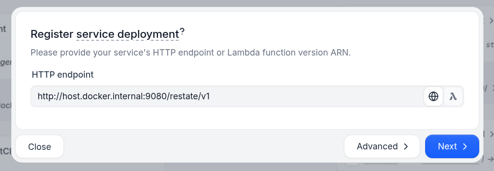

# Resilient A2A Agents with Restate

These examples use [Restate](https://ai.restate.dev/) to implement the [Agent2Agent (A2A) protocol](https://github.com/google/A2A).

Restate acts as a scalable, resilient task orchestrator that speaks the A2A protocol and gives you:
- 🔁 **Automatic retries** - Handles LLM API downtime, timeouts, and infrastructure failures
- 🔄 **Smart recovery** - Preserves progress across failures without duplicating work
- ⏱️ **Persistent task handles** - Tracks progress across failures, time, and processes
- 🎮 **Task control** - Cancel tasks, query status, re-subscribe to ongoing tasks
- 🧠 **Idempotent submission** - Automatic deduplication based on task ID
- 🤖 **Agentic workflows** - Build resilient agents with human-in-the-loop and parallel tool execution
- 💾 **Durable state** - Maintain consistent agent state across infrastructure events
- 👀 **Full observability** - Line-by-line execution tracking with built-in audit trail
- ☁️️ **Easy to self-host** - or connect to Restate Cloud


## Prerequisites
- Python 3.12 or higher
- [UV](https://docs.astral.sh/uv/)
- A [Google API Key](https://platform.openai.com/docs/api-reference/authentication)
    ```shell
    echo "GOOGLE_API_KEY=your_api_key_here" >> .env
    ```

## Quickstart: running the weather agent

This example shows how to run a weather agent (Restate+Google ADK) and use the A2A protocol to communicate with it:

1. Run the application:
    ```bash
    uv run app/weather
    ```
    
    The agent prints the address where it is running: `http://localhost:9080/restate/v1`

2. [Install and launch Restate](https://docs.restate.dev/installation#install-restate-server-%26-cli)
    ```shell
    restate-server
    ```
   
3. Go to the Restate UI at http://localhost:9070. Click on `register deployment`. And fill in the agent url `http://localhost:9080/restate/v1` (for the reimbursement agent).

    

4. Click on the `WeatherAgentA2AServer/process_request` handler of the registered service and send a request using the A2A protocol:
    
    ```shell
    curl localhost:8080/WeatherAgentA2AServer/process_request \
        --json '{
      "jsonrpc": "2.0",
      "id": 142,
      "method": "message/send",
      "params": {
        "message": {
          "role": "user",
          "parts": [
            {
              "kind": "text",
              "text": "What is the weather in Detroit?"
            }
          ],
          "messageId": "92249e7702-767c-417b-a0b0-f0741243c589"
        },
        "metadata": {}
      }
    }' | jq . 
    ```

## Reimbursement example: Experimenting with A2A messages

This is a stateful agent which supports long-running conversations and tasks, giving you time to experiment with the A2A protocol by starting, querying, and canceling tasks.

The example implements a reimbursement workflow where the agent gathers the required input and blocks on human approval if the amount is greater than 100 USD.

### Run the reimbursement agent

1. Run the application:
    ```bash
    uv run app/reimbursement
    ```
    
    The agent prints the address where it is running: `http://localhost:9081/restate/v1`

2. [Launch Restate](https://docs.restate.dev/installation#install-restate-server-%26-cli)
    ```shell
    restate-server
    ```
   
3. Go to the Restate UI at http://localhost:9070. Click on `register deployment`. And fill in the agent url `http://localhost:9081/restate/v1` (for the reimbursement agent).


### Multi-turn conversations

You can do multi-turn conversations with the agent by providing the `contextId` in the message.
If you provide the context ID, the agent will remember the conversation and the tasks you have sent to it.

To start a task that **will block on human approval**, run the following command:

```shell
curl localhost:8080/ReimbursementAgentA2AServer/process_request \
    --json '{
  "jsonrpc": "2.0",
  "id": 1424643,
  "method": "message/send",
  "params": {
    "message": {
      "role": "user",
      "parts": [
        {
          "kind": "text",
          "text": "Reimburse my hotel for my business trip of 5 nights for 1200USD"
        }
      ],
      "taskId": "0d9g9ea6-dcc67-43ee-a389-8s9g0e6es5554",
      "contextId": "5e00b4a6-dcc67-43ee-a389-0e2a65958444",
      "messageId": "9224947643702-7674c-417b-a0b0-f0741243c589"
    },
    "metadata": {}
  }
}' | jq . 
```

It will then return a response mentioning you need to provide a date. 

<details><summary>View output</summary>

```json
{
  "id": 1424643,
  "jsonrpc": "2.0",
  "result": {
    "artifacts": null,
    "contextId": "5e00b4a6-dcc67-43ee-a389-0e2a65958444",
    "history": [
      {
        "contextId": "5e00b4a6-dcc67-43ee-a389-0e2a65958444",
        "extensions": null,
        "kind": "message",
        "messageId": "9224947643702-7674c-417b-a0b0-f0741243c589",
        "metadata": null,
        "parts": [
          {
            "kind": "text",
            "metadata": null,
            "text": "Reimburse my hotel for my business trip of 5 nights for 1200USD"
          }
        ],
        "referenceTaskIds": null,
        "role": "user",
        "taskId": "0d9g9ea6-dcc67-43ee-a389-8s9g0e6es5554"
      }
    ],
    "id": "9224947643702-7674c-417b-a0b0-f0741243c589",
    "kind": "task",
    "metadata": null,
    "status": {
      "message": {
        "contextId": null,
        "extensions": null,
        "kind": "message",
        "messageId": "89194646-702b-4af3-86d5-7c60355fbb77",
        "metadata": null,
        "parts": [
          {
            "kind": "text",
            "metadata": null,
            "text": "MISSING_INFO: Please provide the date of the transaction."
          }
        ],
        "referenceTaskIds": null,
        "role": "agent",
        "taskId": null
      },
      "state": "input-required",
      "timestamp": "2025-11-10T08:57:25.462064"
    }
  }
}
```

</details>

You can then provide the date of the transaction by sending another request to the same stateful session (same task and context ID):

```shell
curl localhost:8080/ReimbursementAgentA2AServer/process_request \
    --json '{
  "jsonrpc": "2.0",
  "id": 1423,
  "method": "message/send",
  "params": {
    "message": {
      "role": "user",
      "parts": [
        {
          "kind": "text",
          "text": "The date of the transaction is 05/04/2025"
        }
      ],
      "taskId": "0d9g9ea6-dcc67-43ee-a389-8s9g0e6es5554",
      "contextId": "5e00b4a6-dcc67-43ee-a389-0e2a65958444",
      "messageId": "92249e73702-767c-417b-a06b0-5sg6g881243c589"
    },
    "metadata": {}
  }
}' | jq . 
```

Possibly, the agent will ask for a final approval before it can proceed with the reimbursement. 
```shell
curl localhost:8080/ReimbursementAgentA2AServer/process_request \
    --json '{
      "jsonrpc": "2.0",
      "id": 22325,
      "method": "message/send",
      "params": {
        "message": {
          "role":"user",
          "parts": [{
            "kind": "text",
            "text": "The info looks good"
          }]
          "taskId": "0d9g9ea6-dcc67-43ee-a389-8s9g0e6es5554",
          "contextId": "5e00b4a6-dcc67-43ee-a389-0e2a65958444",
          "messageId": "92249e737032-767c-417b-a0b0-f0741243c589"
        },
        "metadata": {}
      }
    }' | jq . 
```

Once the agent has all the information, it will ask start the reimbursement process and will block until a human approves the request.

The logs of the agent service will print the curl command to approve the reimbursement and unblock the task.
Or you can leave the task blocked if you want to try out the get and cancel task commands below.

```text
... first part of logs ...
[2025-05-16 13:42:50,410] [310993] [INFO] - Agent session lwp13w5e3sdf258t3wesf13234 -   Starting iteration of agent loop with agent: ReimbursementAgent and tools/handoffs: ['create_request_form', 'reimburse', 'return_form']
[2025-05-16 13:42:50,410] [310993] [INFO] - Agent session lwp13w5e3sdf258t3wesf13234 -  Calling LLM
[2025-05-16 13:42:52,293] [310993] [INFO] - HTTP Request: POST https://api.openai.com/v1/responses "HTTP/1.1 200 OK"
[2025-05-16 13:42:52,303] [310993] [INFO] - Agent session lwp13w5e3sdf258t3wesf13234 -  Executing tool reimburse
================================================== 
 Requesting approval for request_id_1633297 
 Resolve via: 
curl localhost:8080/restate/awakeables/sign_1oqmHpDF_RJQBltjnf48zszmfmRr4w9izAAAAEQ/resolve --json '{"approved": true}' 
==================================================
```

Approve the reimbursement. 

You can have a look at the Restate UI at `http://localhost:9070/ui/invocations` to see the end-to-end flow:


We see how the A2A server called the task object. The task object then called the `invoke` method of the reimbursement agent, which then called the LLM to process the request.
We see how it waited for the human approval and then continued with the reimbursement process. 

Finally, it scheduled the payment task to execute at the end of the month.

**You can now also use the A2A protocol to query the task status and history, or cancel the task:**

#### Get the task

```shell
curl localhost:8080/ReimbursementAgentA2AServer/process_request \
    --json '{
      "jsonrpc": "2.0",
      "id": 2,
      "method":"tasks/get",
      "params": {
        "id": "0d9g9ea6-dcc67-43ee-a389-8s9g0e6es5554",
        "history_length": 10,
        "metadata": {}
      }
    }' | jq . 
```

<details>
<summary>View output</summary>

```json
{
  "id": 2,
  "jsonrpc": "2.0",
  "result": {
    "artifacts": [
      {
        "artifactId": "d2ab957f-003d-49f7-b96d-1a5a83fee3b9",
        "description": null,
        "extensions": null,
        "metadata": null,
        "name": null,
        "parts": [
          {
            "kind": "text",
            "metadata": null,
            "text": "Your reimbursement request with ID da52bd93-1927-4a62-8a15-eaafb29dd899 has been approved."
          }
        ]
      }
    ],
    "contextId": "5e00b4a6-dcc67-43ee-a389-0e2a65958444",
    "history": [
      {
        "contextId": "5e00b4a6-dcc67-43ee-a389-0e2a65958444",
        "extensions": null,
        "kind": "message",
        "messageId": "9224947643702-7674c-417b-a0b0-f0741243c589",
        "metadata": null,
        "parts": [
          {
            "kind": "text",
            "metadata": null,
            "text": "Reimburse my hotel for my business trip of 5 nights for 1200USD"
          }
        ],
        "referenceTaskIds": null,
        "role": "user",
        "taskId": "0d9g9ea6-dcc67-43ee-a389-8s9g0e6es5554"
      },
      {
        "contextId": "5e00b4a6-dcc67-43ee-a389-0e2a65958444",
        "extensions": null,
        "kind": "message",
        "messageId": "92249e73702-767c-417b-a06b0-5sg6g881243c589",
        "metadata": null,
        "parts": [
          {
            "kind": "text",
            "metadata": null,
            "text": "The date of the transaction is 05/04/2025"
          }
        ],
        "referenceTaskIds": null,
        "role": "user",
        "taskId": "0d9g9ea6-dcc67-43ee-a389-8s9g0e6es5554"
      },
      {
        "contextId": null,
        "extensions": null,
        "kind": "message",
        "messageId": "89194646-702b-4af3-86d5-7c60355fbb77",
        "metadata": null,
        "parts": [
          {
            "kind": "text",
            "metadata": null,
            "text": "MISSING_INFO: Please provide the date of the transaction."
          }
        ],
        "referenceTaskIds": null,
        "role": "agent",
        "taskId": null
      }
    ],
    "id": "9224947643702-7674c-417b-a0b0-f0741243c589",
    "kind": "task",
    "metadata": null,
    "status": {
      "message": null,
      "state": "completed",
      "timestamp": "2025-11-10T09:05:15.488894"
    }
  }
}
```

</details>

The Durable Task Object stores the Task data in Restate's embedded K/V store.
We can query the K/V store via the UI. Have a look at the task progress in the Restate UI at `http://localhost:9070/ui/state`:


#### Cancel a Task

For example, start a new reimbursement task and then cancel it:

```shell
curl localhost:8080/ReimbursementAgentA2AServer/process_request \
    --json '{
  "jsonrpc": "2.0",
  "id": 1424443,
  "method": "message/send",
  "params": {
    "message": {
      "role": "user",
      "parts": [
        {
          "kind": "text",
          "text": "Reimburse my hotel for my business trip of 5 nights for 1200USD of 05/04/2025"
        }
      ],
      "messageId": "92249e73702-7674c-417b-a0b0-f0741243c449",
      "taskId": "33349e733702-7674c-417b-a0b0-f0741243c333"
    },
    "metadata": {}
  }
}' | jq . 
```

```shell
curl localhost:8080/ReimbursementAgentA2AServer/process_request \
    --json '{
      "jsonrpc": "2.0",
      "id": 3,
      "method":"tasks/cancel",
      "params": {
        "id": "33349e733702-7674c-417b-a0b0-f0741243c333"
      }
    }' | jq . 
```

<details>
<summary>View output</summary>

```json
{
  "id": 3,
  "jsonrpc": "2.0",
  "result": {
    "artifacts": null,
    "contextId": "a64226cb-90d9-4a9b-b014-c2a3923e3645",
    "history": [
      {
        "contextId": "a64226cb-90d9-4a9b-b014-c2a3923e3645",
        "extensions": null,
        "kind": "message",
        "messageId": "92249e73702-7674c-417b-a0b0-f0741243c449",
        "metadata": null,
        "parts": [
          {
            "kind": "text",
            "metadata": null,
            "text": "Reimburse my hotel for my business trip of 5 nights for 1200USD of 05/04/2025"
          }
        ],
        "referenceTaskIds": null,
        "role": "user",
        "taskId": "33349e733702-7674c-417b-a0b0-f0741243c333"
      },
      {
        "contextId": null,
        "extensions": null,
        "kind": "message",
        "messageId": "3d4d228d-4adf-4dc5-9ff3-2c8c7b45f5aa",
        "metadata": null,
        "parts": [
          {
            "kind": "text",
            "metadata": null,
            "text": "MISSING_INFO: Please provide the request_id."
          }
        ],
        "referenceTaskIds": null,
        "role": "agent",
        "taskId": null
      }
    ],
    "id": "92249e73702-7674c-417b-a0b0-f0741243c449",
    "kind": "task",
    "metadata": null,
    "status": {
      "message": null,
      "state": "canceled",
      "timestamp": "2025-11-10T09:13:41.690479"
    }
  }
}
```

</details>

The UI also shows the task as canceled in the state tab and in the journal overview of the long-running task:


This is implemented via Restate's [cancel task API](https://docs.restate.dev/develop/python/service-communication#cancel-an-invocation).

