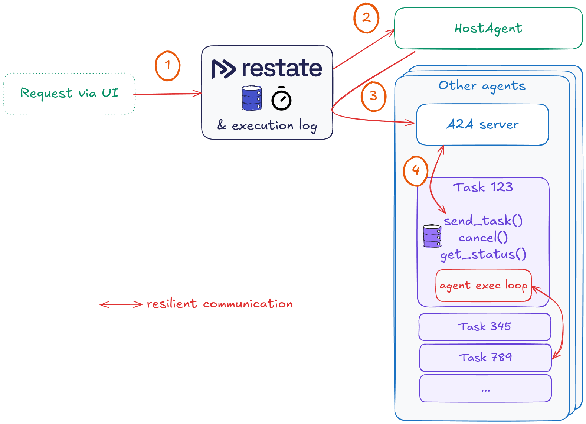
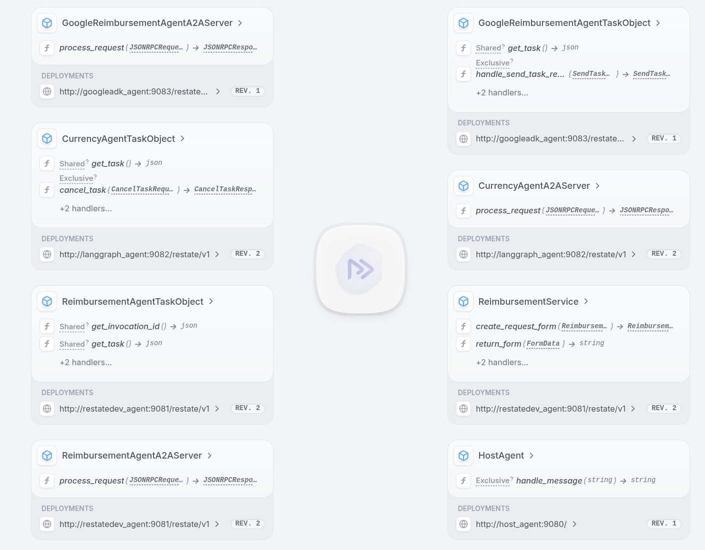
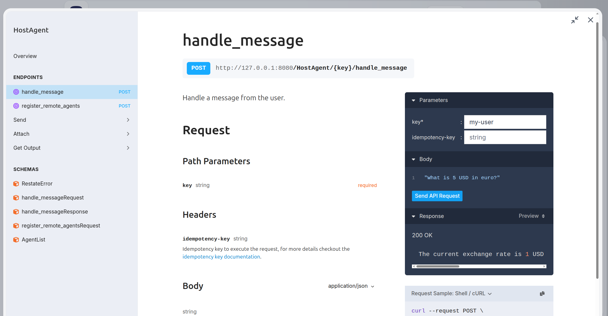
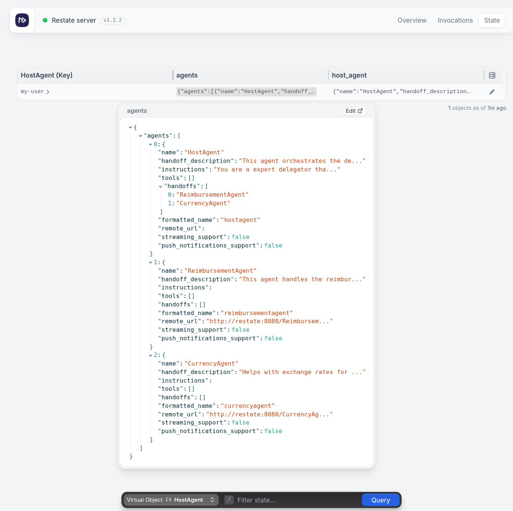
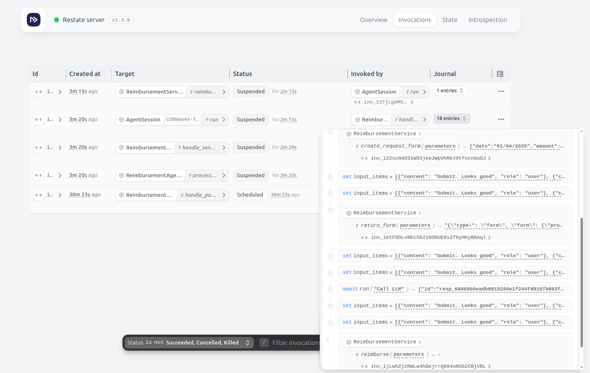
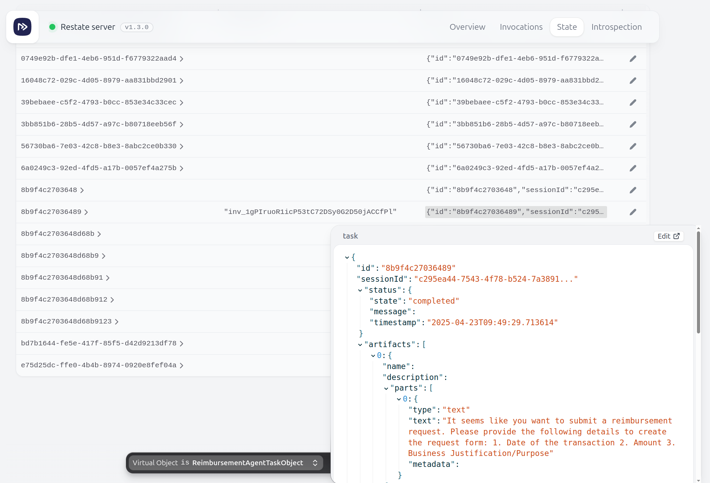

# Resilient A2A Agents with Restate

These examples use [Restate](https://ai.restate.dev/) to implement the [Agent2Agent (A2A) protocol](https://github.com/google/A2A).

Restate acts as a scalable, resilient task orchestrator that speaks the A2A protocol and gives you:
- 🔁 **Automatic retries** - Handles LLM API downtime, timeouts, and infrastructure failures
- 🔄 **Smart recovery** - Preserves progress across failures without duplicating work
- ⏱️ **Persistent task handles** - Tracks progress across failures, time, and processes
- 🎮 **Task control** - Cancel tasks, query status, re-subscribe to ongoing tasks
- 🧠 **Idempotent submission** - Automatic deduplication based on task ID
- 🤖 **Agentic workflows** - Build resilient agents with human-in-the-loop and parallel tool execution
- 💾 **Durable state** - Maintain consistent agent state across infrastructure events
- 👀 **Full observability** - Line-by-line execution tracking with built-in audit trail
- ☁️️ **Easy to self-host** - or connect to Restate Cloud


## Prerequisites

- Python 3.12 or higher
- [UV](https://docs.astral.sh/uv/)
- Access to an LLM and API Key
  - Restate Reimbursement Agent: [OpenAI API Key](https://platform.openai.com/docs/api-reference/authentication)
    ```shell
    echo "OPENAI_API_KEY=your_api_key_here" >> .env
    ```
  - Other agents: [Google API Key](https://ai.google.dev/gemini-api/docs/api-key)
    ```shell
    echo "GOOGLE_API_KEY=your_api_key_here" >> .env
    ```

## Running the example: multi-agent 

This example shows how to run multiple agents and use the A2A protocol to communicate with them.



Make sure you have no other Restate server/services running. Then bring up the multi-agent example:

```shell
docker compose up
```

(It will take a while before all the services are up and running and you will see a few retries for the registration.)

Go to the Restate UI ([`http://localhost:9070`](`http://localhost:9070`)). You see here the overview of the services that are running:



To send messages to the host agent, click on it and then click on the "Playground" button. 



The host agent will forward messages to the registered agents that it knows of, and it will use the A2A protocol to communicate with them.

You can see in the Restate UI to which agents your host agent has access. For `my-user`, we have access to the following:



You can also send messages with the A2A protocol directly to the agents, without going through the host agent:

### LangGraph Currency Agent

To start a task:

```shell
curl localhost:8080/CurrencyAgentA2AServer/process_request \
  --json '{
    "jsonrpc": "2.0",
    "id": 67892345,
    "method":"tasks/send",
    "params": {
        "id": "unique-task-id-79051",
        "sessionId": "session-id-0135",
        "message": {
          "role":"user",
          "parts": [{
          "type":"text",
          "text": "What is the exchange rate from USD to euro?"
          }]
    },
    "metadata": {}
    }
  }' | jq .
```

<details>
<summary>View output</summary>

```json
{
  "jsonrpc": "2.0",
  "id": 67892345,
  "result": {
    "id": "unique-task-id-79051",
    "sessionId": "session-id-0135",
    "status": {
      "state": "completed",
      "message": null,
      "timestamp": "2025-05-21T09:38:05.097677"
    },
    "artifacts": [
      {
        "name": null,
        "description": null,
        "parts": [
          {
            "type": "text",
            "text": "The exchange rate from USD to EUR is 0.8896. That means 1 USD is equivalent to 0.8896 EUR.",
            "metadata": null
          }
        ],
        "metadata": null,
        "index": 0,
        "append": null,
        "lastChunk": null
      }
    ],
    "history": [
      {
        "role": "user",
        "parts": [
          {
            "type": "text",
            "text": "What is the exchange rate from USD to euro?",
            "metadata": null
          }
        ],
        "metadata": null
      }
    ],
    "metadata": null
  },
  "error": null
}
```

</details>

If you send the same task twice, the second attempt will get resolved immediately with the response of the first attempt.
The Restate A2A server automatically takes care of the deduplication.

### Google ADK Reimbursement Agent

To start a task:
     
```shell
curl localhost:8080/GoogleReimbursementAgentA2AServer/process_request \
    --json '{
      "jsonrpc": "2.0",
      "id": 2223,
      "method":"tasks/send",
      "params": {
        "id": "lwp13w5e3sdf258t3wesf13234",
        "sessionId": "lw33sl5e-8966-6g6k-26ee-2d5e6w29ya3423",
        "message": {
          "role":"user",
          "parts": [{
            "type":"text",
            "text": "Reimburse my hotel for my business trip of 5 nights for 1200USD of 05/04/2025"
          }]
        },
        "metadata": {}
      }
    }' | jq . 
```

<details>
<summary>View output</summary>

```json
{
  "jsonrpc": "2.0",
  "id": 2223,
  "result": {
    "id": "lwp13w5e3sdf258t3wesf13234",
    "sessionId": "lw33sl5e-8966-6g6k-26ee-2d5e6w29ya3423",
    "status": {
      "state": "completed",
      "message": null,
      "timestamp": "2025-05-21T09:38:54.553926"
    },
    "artifacts": [
      {
        "name": null,
        "description": null,
        "parts": [
          {
            "type": "text",
            "text": "Your reimbursement request with request ID `request_id_9559913` has been approved.\n",
            "metadata": null
          }
        ],
        "metadata": null,
        "index": 0,
        "append": null,
        "lastChunk": null
      }
    ],
    "history": [
      {
        "role": "user",
        "parts": [
          {
            "type": "text",
            "text": "Reimburse my hotel for my business trip of 5 nights for 1200USD of 05/04/2025",
            "metadata": null
          }
        ],
        "metadata": null
      }
    ],
    "metadata": null
  },
  "error": null
}
```

</details>

### Restate Reimbursement Agent


To start a task that **will block on human approval if the amount is greater than 100 USD**, run the following command:

```shell
curl localhost:8080/ReimbursementAgentA2AServer/process_request \
    --json '{
      "jsonrpc": "2.0",
      "id": 2223,
      "method":"tasks/send",
      "params": {
        "id": "lwp13w5e3sdf258t3wesf13234",
        "sessionId": "lw33sl5e-8966-6g6k-26ee-2d5e6w29ya3423",
        "message": {
          "role":"user",
          "parts": [{
            "type":"text",
            "text": "Reimburse my hotel for my business trip of 5 nights for 1200USD of 05/04/2025"
          }]
        },
        "metadata": {}
      }
    }' | jq . 
```


The logs of the agent service will print the curl command to approve the reimbursement and unblock the task.
Or you can leave the task blocked if you want to try out the get and cancel task commands below.

```text
... first part of logs ...
[2025-05-16 13:42:50,410] [310993] [INFO] - Agent session lwp13w5e3sdf258t3wesf13234 -   Starting iteration of agent loop with agent: ReimbursementAgent and tools/handoffs: ['create_request_form', 'reimburse', 'return_form']
[2025-05-16 13:42:50,410] [310993] [INFO] - Agent session lwp13w5e3sdf258t3wesf13234 -  Calling LLM
[2025-05-16 13:42:52,293] [310993] [INFO] - HTTP Request: POST https://api.openai.com/v1/responses "HTTP/1.1 200 OK"
[2025-05-16 13:42:52,303] [310993] [INFO] - Agent session lwp13w5e3sdf258t3wesf13234 -  Executing tool reimburse
================================================== 
 Requesting approval for request_id_1633297 
 Resolve via: 
curl localhost:8080/restate/awakeables/sign_1oqmHpDF_RJQBltjnf48zszmfmRr4w9izAAAAEQ/resolve --json '{"approved": true}' 
 ==================================================
```

While the task is waiting on human approval, you can have a look at the Restate UI at http://localhost:9070/ui/invocations to see the task progress:




**You can now also use the A2A protocol to query the task status and history, or cancel the task:**

#### Get the task

```shell
curl localhost:8080/ReimbursementAgentA2AServer/process_request \
    --json '{
      "jsonrpc": "2.0",
      "id": 2,
      "method":"tasks/get",
      "params": {
        "id": "lwp13w5e3sdf258t3wesf13234",
        "historyLength": 10,
        "metadata": {}
      }
    }' | jq . 
```

<details>
<summary>View output</summary>

```json
{
  "jsonrpc": "2.0",
  "id": 2,
  "result": {
    "id": "lwp13w5e3sdf258t3wesf13234",
    "sessionId": "lw33sl5e-8966-6g6k-26ee-2d5e6w29ya3423",
    "status": {
      "state": "submitted",
      "message": null,
      "timestamp": "2025-05-16T13:42:46.306507"
    },
    "artifacts": null,
    "history": [
      {
        "role": "user",
        "parts": [
          {
            "type": "text",
            "text": "Reimburse my hotel for my business trip of 5 nights for 1200USD of 05/04/2025",
            "metadata": null
          }
        ],
        "metadata": null
      }
    ],
    "metadata": null
  },
  "error": null
}
```

</details>

The Durable Task Object stores the Task data in Restate's embedded K/V store.
We can query the K/V store via the UI. Have a look at the task progress in the Restate UI at http://localhost:9070/ui/state:



#### Cancel a Task

```shell
curl localhost:8080/ReimbursementAgentA2AServer/process_request \
    --json '{
      "jsonrpc": "2.0",
      "id": 3,
      "method":"tasks/cancel",
      "params": {
        "id": "lwp13w5e3sdf258t3wesf13234",
        "metadata": {}
      }
    }' | jq . 
```

<details>
<summary>View output</summary>

```json
{
  "jsonrpc": "2.0",
  "id": 3,
  "result": {
    "id": "lwp13w5e3sdf258t3wesf13234",
    "sessionId": "lw33sl5e-8966-6g6k-26ee-2d5e6w29ya3423",
    "status": {
      "state": "canceled",
      "message": null,
      "timestamp": "2025-05-16T13:44:05.852323"
    },
    "artifacts": null,
    "history": [
      {
        "role": "user",
        "parts": [
          {
            "type": "text",
            "text": "Reimburse my hotel for my business trip of 5 nights for 1200USD of 05/04/2025",
            "metadata": null
          }
        ],
        "metadata": null
      }
    ],
    "metadata": null
  },
  "error": null
}
```

</details>

This is implemented via Restate's [cancel task API](https://docs.restate.dev/develop/python/service-communication#cancel-an-invocation).

### Stopping the example

To bring the services down, run:

```shell
docker compose down
docker compose rm
```


## Running a single agent

You can also start a single agent together with Restate. 


For example, to run an agent that uses the LangGraph SDK ([`a2a/langgraph`](a2a/langgraph/__main__.py)):

```shell
uv run a2a/langgraph
```

[Start the Restate Server](https://docs.restate.dev/develop/local_dev) in a separate shell:
    ```shell
    restate-server
    ```

Then register the service:

```shell
restate -y deployments register http://localhost:9082/restate/v1
```

Then send requests to the agent.