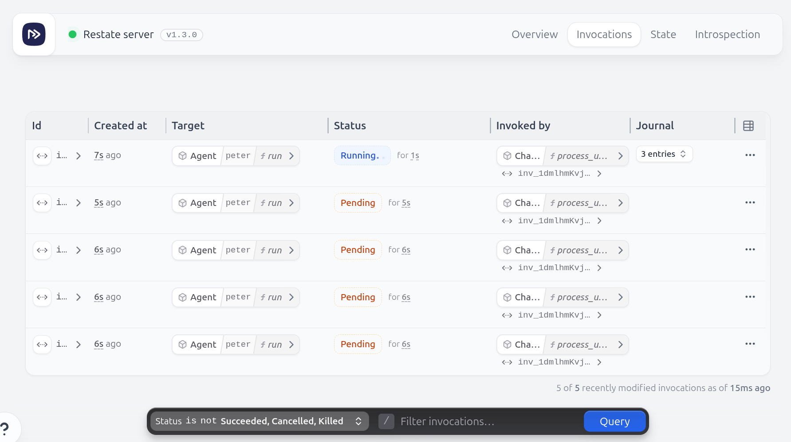

# Restate Interruptible Agent

This example implements an agent whose work can be interrupted when new input become available.


Important files:
- [`chat.py`](app/chat.py): The chat service, which receives the user input and agent responses. Based on the selected operational mode, it interacts differently with the ongoing agent runs on new inputs. 
The chat session is keyed by the user ID. 
- [`agent.py`](app/agent.py): The agent session which executes the customized agent loop.

The agent has three modes:
- **INTERRUPT**: The current agent run will be canceled when a new user input is received. A new run will be started. You could implement a rollback mechanism to restore the previous state.
- **INCORPORATE**: On its next iteration, the agent will check if a new user input has been received. If so, it will incorporate the new input into its current state and continue running.
- **QUEUE**: The current agent will continue running. The new user input will be queued as a new agent run request and will be processed after the current agent run is finished.

You could adapt this example to let every user set his preferred way of interacting with agents. 

## Why Restate?

The main features of Restate that this example shows are:
- 🎮 **Task control** - Cancel tasks, retrieve tasks and send them more inputs on which they can act.
- 📨 **Durable Promises** - Create a resilient promise that can be resolved from the outside, and can be recovered across processes and time. 
- 💾 **Persistent memory** - Maintain session state across infrastructure events. The chat session tracks ongoing agent runs and interacts with them when it receives new inputs.
- 🔧 **Flexibility and customization** - Customize your agent implementations to your needs without sacrificing resiliency.

## Running the example

Start the service:
```shell
MODE=INCORPORATE uv run app
```
or use `MODE=INTERRUPT` or `MODE=QUEUE`.

Start Restate:
```shell
restate-server
```

Open the UI on http://localhost:9070 and register your deployment running at `http://localhost:9080`, or do:

```shell
restate -y deployments register localhost:9080 --force
```

Then, start a task:

```shell
curl localhost:8080/ChatService/peter/process_user_message --json '{
  "content": "Prepare a burger and a caesar salad.",
  "role": "user"
}'
```

A bit later, start a new task:

```shell
curl localhost:8080/ChatService/peter/process_user_message --json '{
  "content": "Oh, and please add some croutons to the salad!",
  "role": "user"
}'
```

Depending on the mode you selected, the behavior will be different.

You can see the chat history by executing:
```shell
curl localhost:8080/ChatService/peter/get_chat_history
```

You will see the agent response after a while.


### `INCORPORATE` mode

In this mode, the agent will check if a new user input has been received on its next iteration. If so, it will incorporate the new input into its current state and continue running.

If you send a few messages to the same session, you will see the logs printing the new user input:

```text
[2025-05-23 09:35:26,789] [INFO] chat: Starting new agent run
[2025-05-23 09:35:28,446] [INFO] agent: Agent generated output: ResponseFunctionToolCall(arguments='{"description":"Prepare a classic beef burger with lettuce, tomato, cheese, and pickles. Toast the bun and grill the patty to desired doneness. Assemble the ingredients and serve with condiments like ketchup and mustard."}', call_id='call_1aZ3T7NFdaOA6u85juLGvfCF', name='execute_task', type='function_call', id='fc_6830253f7e0c8198a7c602e05d7c62bb00b2fd2a5937f809', status='completed')
[2025-05-23 09:35:28,446] [INFO] agent: Executing a slow task with description: Prepare a classic beef burger with lettuce, tomato, cheese, and pickles. Toast the bun and grill the patty to desired doneness. Assemble the ingredients and serve with condiments like ketchup and mustard....
[2025-05-23 09:35:28,971] [INFO] chat: Incorporating new input into ongoing agent run
[2025-05-23 09:35:28,975] [INFO] agent: Resolved awakeable with ID sign_1g9a55SHkGQ8BlvwRfUbOfut3bMc8yEVUAAAAEQ with new input for ela: Oh, and please add some croutons to the salad!
[2025-05-23 09:35:33,455] [INFO] agent: Incorporating new input for ela: Oh, and please add some croutons to the salad!
[2025-05-23 09:35:34,754] [INFO] agent: Agent generated output: ResponseFunctionToolCall(arguments='{"description":"Prepare a Caesar salad by tossing fresh romaine lettuce with Caesar dressing, grated Parmesan cheese, and croutons. Optionally, add grilled chicken for extra protein."}', call_id='call_Byjwsk8iMyFDgfTipzgpLpUX', name='execute_task', type='function_call', id='fc_683025461b0881988e40f1e6ec2cd8820ebdb7c5080da515', status='completed')
[2025-05-23 09:35:34,754] [INFO] agent: Executing a slow task with description: Prepare a Caesar salad by tossing fresh romaine lettuce with Caesar dressing, grated Parmesan cheese, and croutons. Optionally, add grilled chicken for extra protein....
[2025-05-23 09:35:41,251] [INFO] agent: Agent generated output: ResponseOutputMessage(id='msg_6830254c94488198bcaa655e514b7e4408f6afd2a39cc0f0', content=[ResponseOutputText(annotations=[], text="I've prepared a classic beef burger with all the fixings and a Caesar salad with croutons. Enjoy your meal! If you need anything else, feel free to ask.", type='output_text')], role='assistant', status='completed', type='message')
[2025-05-23 09:35:41,254] [INFO] agent: Final output message: I've prepared a classic beef burger with all the fixings and a Caesar salad with croutons. Enjoy your meal! If you need anything else, feel free to ask.
```

Depending on how you want to handle the new input, you can also choose to cancel the current iteration (by pulling it into a Service handler) and start a new one with the new input. 


### `INTERRUPT` mode

In this mode, the current agent will be canceled when a new user input is received. A new run will be started. You could implement a rollback mechanism to restore the previous state ([see saga guide](https://docs.restate.dev/guides/sagas)).

Start the service with `MODE=INTERRUPT`.

To start from a clean slate, use a different chat session name (e.g. `ella` instead of `ella`).

```shell
curl localhost:8080/ChatService/ella/process_user_message \
  --json '{
  "content": "Prepare a burger and a caesar salad.",
  "role": "user"
}'
```

A bit later, start a new task:

```shell
curl localhost:8080/ChatService/ella/process_user_message \
  --json '{
  "content": "Oh, and please add some croutons to the salad!",
  "role": "user"
}'

If you send a few messages to the same session, you will see the cancellation in the logs and the UI will show only the new task.

```text
[2025-05-23 09:44:13,352] [INFO] agent: Starting new agent run with input: [{'role': 'user', 'content': 'Prepare a burger and a caesar salad.'}]
[2025-05-23 09:44:14,562] [INFO] agent: Agent generated output: ResponseFunctionToolCall(arguments='{"description":"Prepare a burger."}', call_id='call_vEJGDYx8gZM3sq6JO6PjzAFT', name='execute_task', type='function_call', id='fc_6830274e473c8198a9a397c8727cfd2b044f315dc8a4cbd9', status='completed')
[2025-05-23 09:44:14,562] [INFO] agent: Executing a slow task with description: Prepare a burger....
[2025-05-23 09:44:19,121] [INFO] chat: Interrupting ongoing agent run
[2025-05-23 09:44:19,127] [INFO] agent: Starting new agent run with input: [{'role': 'user', 'content': 'Prepare a burger and a caesar salad.'}, {'role': 'user', 'content': 'Oh, and please add some croutons to the salad!'}]
[2025-05-23 09:44:20,233] [INFO] agent: Agent generated output: ResponseFunctionToolCall(arguments='{"description":"Prepare a burger."}', call_id='call_U2WBq3shlfa3h02uVG81rks4', name='execute_task', type='function_call', id='fc_68302753d6c08198b59e2779dd0c3ba60082afaf9e173e03', status='completed')
[2025-05-23 09:44:20,233] [INFO] agent: Executing a slow task with description: Prepare a burger....
[2025-05-23 09:44:26,480] [INFO] agent: Agent generated output: ResponseFunctionToolCall(arguments='{"description":"Prepare a Caesar salad with croutons."}', call_id='call_AoHlcVD9vOqajBeBTqnaftuG', name='execute_task', type='function_call', id='fc_6830275a1b708198b2857a49ecae60ca049be2f13923f0e7', status='completed')
[2025-05-23 09:44:26,480] [INFO] agent: Executing a slow task with description: Prepare a Caesar salad with croutons....
[2025-05-23 09:44:32,713] [INFO] agent: Agent generated output: ResponseOutputMessage(id='msg_6830276056f0819896aca34abe3480cc0e4811b8a49327cf', content=[ResponseOutputText(annotations=[], text='The burger is ready, and the Caesar salad has been prepared with croutons. Enjoy your meal!', type='output_text')], role='assistant', status='completed', type='message')
[2025-05-23 09:44:32,715] [INFO] agent: Final output message: The burger is ready, and the Caesar salad has been prepared with croutons. Enjoy your meal!
```


### `QUEUE` mode

In this mode, the new tasks get queued. If you send a few messages to the same session, you will see the pending tasks in the UI.

Start the service with `MODE=QUEUE`. And use again a different chat session name (replace `peter`).


