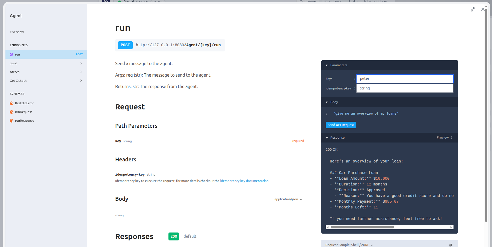
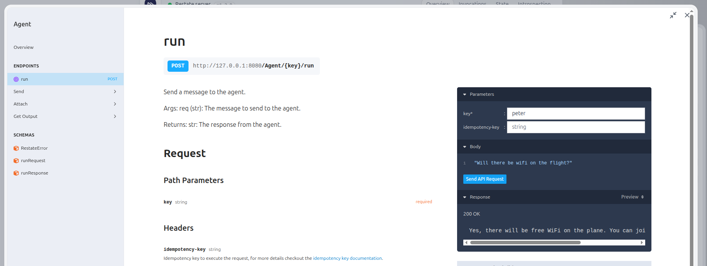

# Resilient agents with Restate
In these examples, we show how to use Restate (optionally together with Agent SDKs) to build scalable, resilient agent sessions.

We use Restate's stateful entities called Virtual Objects to manage the session state and retries for us. 


Check out [this file](openai_sdk/agent_session.py) for an example.

**What you get from using Restate in combination with an Agent SDK:**
- **Scalability**: you can run multiple agent sessions in parallel, and Restate will manage the state for you. 
It will make sure a single session processes requests in order, and that the state is consistent.
- **Session/context management**: you can store the session state (input items) in Restate and have it consistent and durable across calls and failures. 
The state can also be queried from the outside and viewed in the Restate UI.
- **Resiliency**: retries and recovery of ongoing progress and state (see caveats below).
- **Idempotency** for invocations: deduplicating requests to the same agent.

**What you are missing out on if you don't integrate Restate into the agent loop** (see below):
- You don't log/persist any of the operations that happen within the agent loop. 
- The execution of an end-to-end agent loop is seen as a single non-deterministic `ctx.run` operation.
- When something fails halfway through the loop, the loop is retried from the beginning, potentially leading to a different execution path and result.
- No fine-grained retries of tool executions. 
- You cannot use the Restate context directly in any of the tools. Meaning, no access to Durable Execution, durable RPC, timers, etc.
- From within a tool, you could execute an HTTP call to a Restate handler, but this could get scheduled multiple times on retries. 
It's also seen as a new invocation, so the observability experience is less nice. 
- Since the agent loop and tool calls do not take part in Durable Execution, it's also harder (although not impossible) to implement and execute rollback patterns when needed.  


## Using Restate for implementing the agent loop

If you look at Agent SDKs today, the most important logic is in the agent loop. In essence, this is implemented as follows:

1. A request (often in human language) gets forwarded to an LLM, together with a prompt describing the agent description/persona the LLM should impersonate, and which tasks it can order.
2. The LLM then answers with a response. This can either be a human language response that needs to be sent back to the caller, or a structured format like JSON that describes a routing decision to:
    1. Another agent: In this case, we change the agent the LLM should assume (basically changing the prompt), and the respective tools it can access, and loop back to point one.
    2. A tool: Execute the tool and go back to point one. The request that gets send to the LLM now includes the tool output.

Instead of using an Agent SDK, we can implement this loop with Restate constructs to get avoid the caveats we mentioned in the previous example.

**This gives your agentic workflow the same resiliency and capabilities as what you get with a "traditional" workflow.**

If we implement the agent loop with Restate, Restate journals each of the decisions the agents make and manages the tool executions.

**The agent composes the workflow on the fly, and Restate persists the execution as it takes place.**

The agent session is a Restate Virtual Object that has a handler that runs the agent loop.

The benefits of using Restate for agentic workflows are:
- **Flexibility and control over the loop implementation**: The agent loop we implemented here can be a starting point for resilient agent sessions, that can be adapted in any way desired for the use case: e.g. more control/feedback loops over decisions, etc. 
- **Fine-grained retries and recovery**: Restate retries only the failed step and preserves the rest of the progress. This makes the system robust and fast at recovery. 
- **Observability across agents, tools and other code execution**: Restate tracks the progress requests make in a journal, that includes the entire path through the agent loop, the tool execution, and any other code or workflows that get executed as part of the request. As opposed to traces with agent SDKs, the journal is not sampled and includes the entire execution across services and tools. 
- **Long-running workflows**: Workflows can run for days, weeks, or even months. Restate persists them durably and can resume them at any time. For example, durable human-in-the loop control flow or waiting on some event to happen before continuing.
- **Scheduled operation**: Agents can schedule tasks for later on, for example "send me an invoice after my flight". Restate tracks timers durably. 
- **Human-in-the-loop**: Restate gives you Durable Promises which make it easy to implement things like human feedback loops or external processes notifying the agent when something has happened/completed. 
- **Task management**: You can later on cancel tasks with guaranteed rollback, or latch on to retrieve their results.
- **Exactly-once tool calls**: Restate deduplicates tool calls during retries. 
- **Robust parallel tool calls**: Restate manages the execution of the parallel tool calls and retries them if they fail.
- **Serverless/FaaS deployment** of agent sessions and tools (e.g. AWS Lambda): Restate lets your functions suspend when they are waiting for a long time. You can mix and match: slow processes like the LLM call can run on a long-running server, while the rest of the workflow can run on serverless for demand-based scaling.

For example, we can implement an [agent that can answer questions about our bank account and transactions](native_restate). 
In this case, the agent session connected to a chat session and to the account Virtual Object: 


In [this example](native_restate/chat.py), you specify the agents, their descriptions and their tools in a configuration similar to the OpenAI Agents SDK.
But in this case, all the tools are Restate handlers.

Here is what a slightly simplified version of the agent loop with Restate looks like: [agent_session.py](native_restate/utils/agent_session.py) file.

This code can be extended and changed based on the use case. 


## Running the examples

### Restate-native example

This example implements a bank agent that can answer questions about your balance, loans and transactions.

1. Export your OpenAI or Anthrophic API key as an environment variable:
    ```shell
    export OPENAI_API_KEY=your_openai_api_key
    ```
2. [Start the Restate Server](https://docs.restate.dev/develop/local_dev) in a separate shell:
    ```shell
    restate-server
    ```
3. Start the services:
    ```shell
    uv run native_restate
    ```
4. Register the services (use `--force` if you already had another deployment registered at 9080): 
    ```shell
    restate -y deployments register localhost:9080
    ```
   
Now you can send requests to the agent via the UI playground (click on the agent service and then `playground`):



Or with the client:

- **Request**: 
   ```shell
   uv run client.py "how much is my balance?"
   ```
   Example response: `Your current balance is $100,000.00. If you have any other questions, feel free to ask!`

- **Request**:
   ```shell
   uv run client.py "how much did I spend on gambling last month?"
   ```
   Example response: `I reviewed your transactions from last month, and it appears you didn't spend any money on gambling during that period. If you have any other questions or need further clarification, please let me know!`

- **Request**: 
   
   ```shell
   uv run client.py "give me an overview of my outstanding loans and credit"
   ```
   
   Example response:
   ```
   Here's an overview of your outstanding loans:
   
   1. **Car Purchase Loan**
      - **Amount**: $10,000
      - **Duration**: 12 months
      - **Approved**: Yes
      - **Reason**: Good credit score and no risky transactions like gambling.
      - **Monthly Payment**: $9,856.07
      - **Months Left**: 11
   
   If you need more information, feel free to ask!
   ```
   

### Restate + Asgent SDK

This example implements a airline customer service agent that can answer questions about your flights, and change your seat.


1. Export your OpenAI or Anthrophic API key as an environment variable:
    ```shell
    export OPENAI_API_KEY=your_openai_api_key
    ```
2. [Start the Restate Server](https://docs.restate.dev/develop/local_dev) in a separate shell:
    ```shell
    restate-server
    ```
3. Start the services:
    ```shell
    uv run openai_sdk
    ```
4. Register the services (use `--force` if you already had another deployment registered at 9080): 
    ```shell
    restate -y deployments register localhost:9080
    ```
   

Now you can send requests to the agent via the UI playground (click on the agent service and then `playground`):



Or with the client:

- **Request**: 
   
   ```shell
    uv run client.py "how much can my bag weigh?"          
   ```
   
   Example response: `Your bag can weigh up to 50 pounds and should not exceed the dimensions of 22 inches x 14 inches x 9 inches.`

- **Request**: 
   
   ```shell
   uv run client.py "can you change my seat to 5b?"
   ```
   
   Example response: `To change your seat to 5B, I'll need your confirmation number. Could you please provide that?`

- **Request**: 
   
   ```shell
   uv run client.py "5666"                         
   ```
   
   Example response: `Your seat has been successfully changed to 5B. If there's anything else you need, feel free to ask!`