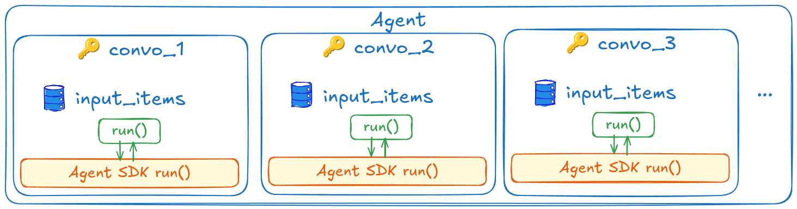
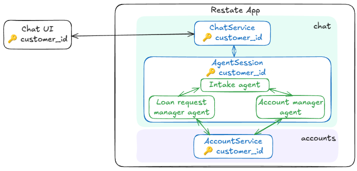
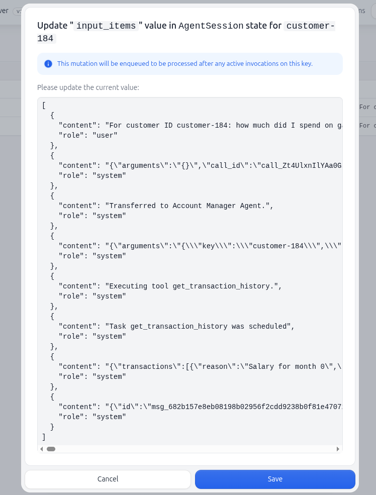

# Resilient agents with Restate

**Give your agentic workflow the same resiliency and capabilities as what you get with a "traditional" workflow.**

**The agent composes the workflow on the fly, and Restate persists the execution as it takes place.**

Restate powers your agents with the following features:
- 🛡️ **Automatic retries**: Built-in retry mechanisms for failed operations
- 🔐 **Recovery of decisions and tool results**: Restate retries only the failed step and preserves the rest of the progress
- 🔄 **Stateful agent sessions**: Isolate different sessions/conversations with Virtual Objects. Get isolated memory and concurrency guarantees per object. Memory is queryable from the outside and viewable in the Restate UI
- 🚀 **Scalability**: Parallel sessions with consistent state
- 🔍 **Observability**: Via the Restate UI and OTEL traces, you get line-by-line execution tracking and insight into tool executions and hand-off chains
- ⏱️ **Long-running Agentic Workflows**: Durability for any workflow from millis to months. And built-in durable timers & scheduling
- 🙂 **Resilient human-in-the-loop**: Both approaches support human intervention in workflows
- 👬 **Idempotency/deduplication**: Prevents duplicate agent requests

Key Differences
- **Restate + Agent SDK** is ideal for turning brittle agent implementations into resilient ones. It offers faster initial setup and resiliency for the agentic workflow. However, it doesn't support agent loop customization or parallel tasks.
- **Native Restate Implementation** can be used to customize agent loops. It provides full customization possibilities (like interruptible agents and saga patterns) and supports parallel tool calls, but requires managing and writing the agent loop yourself.

## Plugging Restate into existing Agent SDKs
Combine Restate's durability with existing Agent SDKs for rapid development.

To make the agent resilient, we need to:
- persist the results of LLM calls in Restate's journal by wrapping them in `ctx.run()`
- have the context available to us in the tools so that we can use it to persist the intermediate tool execution steps.

The details of how to do this depend on the Agent SDK you are using.

⚠ **LIMITATIONS**: You cannot do parallel tool calls or any type of parallel execution if you integrate Restate with an Agent SDK. 
If you execute actions on the context in different tools in parallel, Restate will not be able to deterministically replay them because the order might be different during recovery and will crash. 
We are working on a solution to this, but for now, you can only use Restate with Agent SDKs for sequential tool calls.

### Restate + OpenAI Agent SDK
[](openai_sdk/agent.py)

Use the OpenAI Agent SDK to implement the agent loop, while Restate handles the persistence and resiliency of the agent's decisions and tool executions.

The OpenAI Agent SDK lets you wrap the LLM calls into durable actions by implementing a Restate Model Provider ([code](openai_sdk/middleware.py)).
In order to have access to the Restate context in the tools, we can pass it along in the context that we pass to the tools. 

The example is a customer service agent for an airline that can send invoices and update seat bookings.
This is [an OpenAI SDK example](https://github.com/openai/openai-agents-python/blob/main/examples/customer_service/main.py) that has been adapted to use Restate for resiliency and workflow guarantees:



### Other Agent SDKs
Are you using another Agent SDK? We can help you evaluate whether it can be integrated with Restate. 
Join our [Discord](https://discord.gg/skW3AZ6uGd) or [Slack](https://join.slack.com/t/restatecommunity/shared_invite/zt-2v9gl005c-WBpr167o5XJZI1l7HWKImA) to discuss.

## Native Restate Implementation
[](native_restate/agent.py)

Implement the agent loop directly with Restate for maximum control.

If we implement the agent loop with Restate, Restate journals each of the decisions the agents make and manages the tool executions.
The agent session is a Restate Virtual Object that has a handler that runs the agent loop.



## Running the examples

### Restate + Agent SDK 
[](openai_sdk/agent.py)

This example implements an airline customer service agent that can answer questions about your flights, and change your seat.

The example uses the OpenAI Agent SDK to implement the agent. Although this could be adapted to other agent SDKs.


1. Export your OpenAI or Anthrophic API key as an environment variable:
    ```shell
    export OPENAI_API_KEY=your_openai_api_key
    ```
2. [Start the Restate Server](https://docs.restate.dev/develop/local_dev) in a separate shell:
    ```shell
    restate-server
    ```
3. Start the services:
    ```shell
    uv run openai_sdk
    ```
4. Register the services: 
    ```shell
    restate -y deployments register localhost:9080 --force
    ```
   

Now you can send requests to the agent via the UI playground (click on the agent service and then `playground`):


Or with the [client](client/__main__.py):

- **Request**: 
   
   ```shell
    uv run client "can you send me an invoice for booking AB4568?"          
   ```
   
   Example response: `I've sent the invoice to your email associated with confirmation number AB4568. If there's anything else you need, feel free to ask!.`

- **Or have longer conversations**: 
   
   ```shell
   uv run client "can you change my seat to 10b?"
   ```
   
   Example response: `To change your seat to 10B, I'll need your confirmation number. Could you please provide that?`

   Respond to the question by sending a new message to the same stateful session:
   ```shell
   uv run client "5666"                         
   ```
   
   Example response: `Your seat has been successfully changed to 5B. If there's anything else you need, feel free to ask!`


### Restate-native example
[](native_restate/agent.py)

This example implements a bank agent that can answer questions about your balance, loans and transactions.

1. Export your OpenAI key as an environment variable:
    ```shell
    export OPENAI_API_KEY=your_openai_api_key
    ```
2. [Start the Restate Server](https://docs.restate.dev/develop/local_dev) in a separate shell:
    ```shell
    restate-server
    ```
3. Start the services:
    ```shell
    uv run native_restate
    ```
4. Register the services: 
    ```shell
    restate -y deployments register localhost:9080 --force
    ```
   
Now you can send requests to the agent via the UI playground (click on the agent service and then `playground`):


Or with the [client](client/__main__.py):

- **Request**: 
   ```shell
   uv run client "how much is my balance?"
   ```
   Example response: `Your current balance is $100,000.00. If you have any other questions, feel free to ask!`

- **Request**:
   ```shell
   uv run client "how much did I spend on gambling last month?"
   ```
   Example response: `I reviewed your transactions from last month, and it appears you didn't spend any money on gambling during that period. If you have any other questions or need further clarification, please let me know!`

- **Request**: 
   
   ```shell
   uv run client "give me an overview of my outstanding loans and credit"
   ```
   
   Example response:
   ```
   Here's an overview of your outstanding loans:
   
   1. **Car Purchase Loan**
      - **Amount**: $10,000
      - **Duration**: 12 months
      - **Approved**: Yes
      - **Reason**: Good credit score and no risky transactions like gambling.
      - **Monthly Payment**: $9,856.07
      - **Months Left**: 11
   
   If you need more information, feel free to ask!
   ```
   
You can see the state of your agent in the state tab in the UI:

