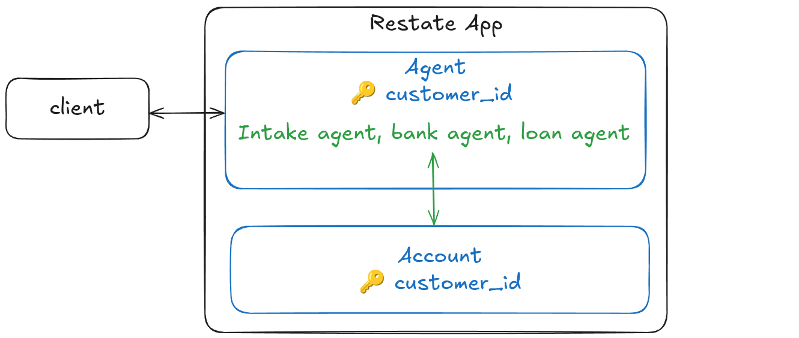

# Resilient agents with Restate
In these examples, we show how to use Restate (optionally together with Agent SDKs) to build scalable, resilient agent sessions.


### Option 1: Restate + Agent SDK
Combine Restate's durability with existing Agent SDKs for rapid development.

We use Restate's stateful entities called Virtual Objects to manage the session state and retries for us. 


### Option 2: Native Restate Implementation
Implement the agent loop directly with Restate for maximum control and resilience.

**This gives your agentic workflow the same resiliency and capabilities as what you get with a "traditional" workflow.**

**The agent composes the workflow on the fly, and Restate persists the execution as it takes place.**

If we implement the agent loop with Restate, Restate journals each of the decisions the agents make and manages the tool executions.
The agent session is a Restate Virtual Object that has a handler that runs the agent loop.



## ✨ Feature Comparison

| Feature                                                                                                                                                                                               | **Restate + Agent SDK**                                                                                                                                                        | **Native Restate Implementation**                                                                                                                                     |
|-------------------------------------------------------------------------------------------------------------------------------------------------------------------------------------------------------|--------------------------------------------------------------------------------------------------------------------------------------------------------------------------------|-----------------------------------------------------------------------------------------------------------------------------------------------------------------------|
| **🛡️ Automatic retries**                                                                                                                                              | ✅                                                                                                                                                                              | ✅                                                                                                                                                                     |
| **🔐 Recovery of decisions and tool results**: Restate retries only the failed step and preserves the rest of the progress.                                                                           | ❌ Complete agent loop gets re-executed on retries                                                                                                                              | ✅                                                                                                                                                                     |
| **🔄 Agent memory**: Consistent across failures and processes. Queryable from the outside and viewable in the Restate UI.                                                                             | ✅                                                                                                                                                                              | ✅                                                                                                                                                                     |
| **🚀 Scalability**: Parallel sessions with consistent state.                                                                                                                                          | ✅                                                                                                                                                                              | ✅                                                                                                                                                                     |
| **🔍 Observability**: Use the Restate UI and OTEL traces to get line-by-line execution tracking.                                                                                                      | ✅ Session-level tracking<br/>❌ Agent loop as black box<br/>❌ No tool visibility                                                                                                | ✅ Complete tool execution and hand-off journaling<br/>✅ Tool execution details                                                                                        |
| **⏱️ Long-running Tasks**: Agents and their tools can run for millis or months. And tasks can be durably scheduled for later.                                                                         | ✅ Basic session state persistence<br/>✅ Durable scheduling of tools <br/>❌ No recovery of intermediate results of long-running agents.                                         | ✅ Durable workflows (days/weeks)<br/>✅ Built-in timers & scheduling                                                                                                   |
| **🔧 Task Control & Flexibility**: Cancel tasks with robust rollback, query status, re-subscribe to ongoing tasks, on-the-fly incorporate new inputs, and more, with Restate's flexible task control. | ❌ No agent loop customization<br/>✅ Cancel/resubscribe                                                                                                                         | ✅ Full customization possible<br/>✅ Custom decision logic<br/>✅ Cancel/resubscribe/incorporate inputs/...                                                             |
| **⚙️ Special capabilities**                                                                                                                                                                           | ✅ Resilient human-in-the-loop callbacks <br/>❌ Durable scheduling / parallel tasks <br/> ✅ Idempotency/deduplication of agent requests. <br/>❌ Tools execute again on retries. | ✅ Resilient human-in-the-loop <br/>✅ Resilient scheduling and parallel tool calls<br/>✅ Idempotency/deduplication of agent requests<br/>✅ Exactly-once tool execution |
| **🚀 Development Speed**                                                                                                                                                                              | ✅ Faster initial setup<br/>✅ Basic resiliency for any Agent SDK<br/>✅ Quick prototyping                                                                                        | ❌ Manage/write the agent loop <br/>✅ Innate resiliency and control from your first LLM-SDK-based app to low-level, customized multi-agent applications.               |

### 🎯 **Recommendation**

- **Choose Restate + Agent SDK** for: Quick prototypes, proof of concepts, or when you don't want to manage the agent loop yourself.
- **Choose Native Restate** for: Production systems, customized agent loops, complex workflows, applications requiring fine-grained control, or long-running agent processes.


## Running the examples

### Restate-native example

This example implements a bank agent that can answer questions about your balance, loans and transactions.

1. Export your OpenAI or Anthrophic API key as an environment variable:
    ```shell
    export OPENAI_API_KEY=your_openai_api_key
    ```
2. [Start the Restate Server](https://docs.restate.dev/develop/local_dev) in a separate shell:
    ```shell
    restate-server
    ```
3. Start the services:
    ```shell
    uv run native_restate
    ```
4. Register the services (use `--force` if you already had another deployment registered at 9080): 
    ```shell
    restate -y deployments register localhost:9080
    ```
   
Now you can send requests to the agent via the UI playground (click on the agent service and then `playground`):


Or with the client:

- **Request**: 
   ```shell
   uv run client.py "how much is my balance?"
   ```
   Example response: `Your current balance is $100,000.00. If you have any other questions, feel free to ask!`

- **Request**:
   ```shell
   uv run client.py "how much did I spend on gambling last month?"
   ```
   Example response: `I reviewed your transactions from last month, and it appears you didn't spend any money on gambling during that period. If you have any other questions or need further clarification, please let me know!`

- **Request**: 
   
   ```shell
   uv run client.py "give me an overview of my outstanding loans and credit"
   ```
   
   Example response:
   ```
   Here's an overview of your outstanding loans:
   
   1. **Car Purchase Loan**
      - **Amount**: $10,000
      - **Duration**: 12 months
      - **Approved**: Yes
      - **Reason**: Good credit score and no risky transactions like gambling.
      - **Monthly Payment**: $9,856.07
      - **Months Left**: 11
   
   If you need more information, feel free to ask!
   ```
   

### Restate + Agent SDK

This example implements a airline customer service agent that can answer questions about your flights, and change your seat.


1. Export your OpenAI or Anthrophic API key as an environment variable:
    ```shell
    export OPENAI_API_KEY=your_openai_api_key
    ```
2. [Start the Restate Server](https://docs.restate.dev/develop/local_dev) in a separate shell:
    ```shell
    restate-server
    ```
3. Start the services:
    ```shell
    uv run openai_sdk
    ```
4. Register the services (use `--force` if you already had another deployment registered at 9080): 
    ```shell
    restate -y deployments register localhost:9080
    ```
   

Now you can send requests to the agent via the UI playground (click on the agent service and then `playground`):


Or with the client:

- **Request**: 
   
   ```shell
    uv run client.py "how much can my bag weigh?"          
   ```
   
   Example response: `Your bag can weigh up to 50 pounds and should not exceed the dimensions of 22 inches x 14 inches x 9 inches.`

- **Request**: 
   
   ```shell
   uv run client.py "can you change my seat to 5b?"
   ```
   
   Example response: `To change your seat to 5B, I'll need your confirmation number. Could you please provide that?`

- **Request**: 
   
   ```shell
   uv run client.py "5666"                         
   ```
   
   Example response: `Your seat has been successfully changed to 5B. If there's anything else you need, feel free to ask!`