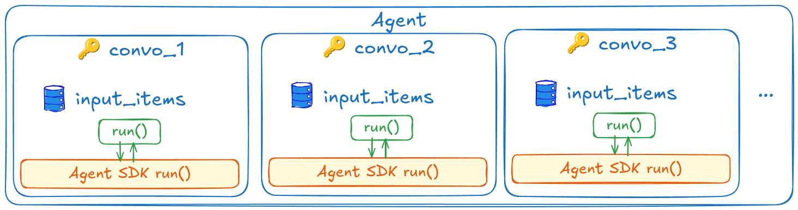
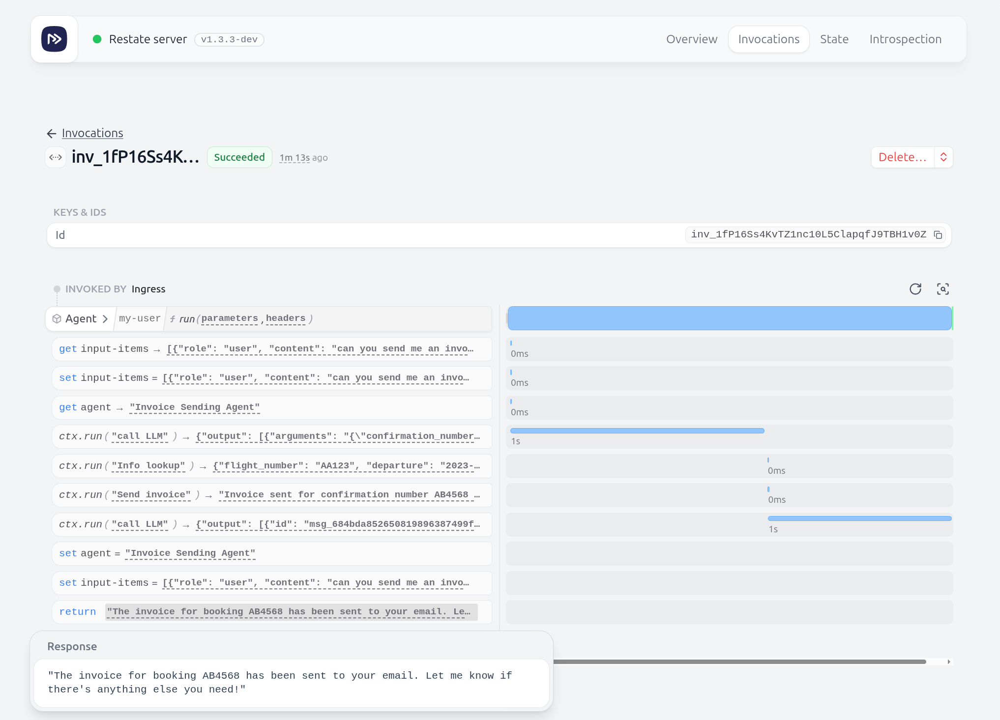
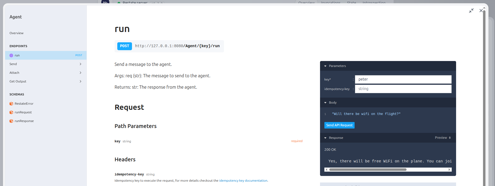

# Resilient agents with Restate + OpenAI Agents Python SDK

**Give your agentic workflow the same resiliency and capabilities as what you get with a "traditional" workflow.**

**The agent composes the workflow on the fly, and Restate persists the execution as it takes place.**

Combining Restate and the OpenAI Agent SDK is ideal for turning the default brittle agents into resilient ones. 

Restate powers your agents with the following features:
- 🛡️ **Automatic retries**: Built-in retry mechanisms for failed operations
- 🔐 **Recovery of decisions and tool results**: Restate retries only the failed step and preserves the rest of the progress
- 🔄 **Stateful agent sessions**: Isolate different sessions/conversations with Virtual Objects. Get isolated memory and concurrency guarantees per object. Memory is queryable from the outside and viewable in the Restate UI
- 🚀 **Scalability**: Parallel sessions with consistent state
- 🔍 **Observability**: Via the Restate UI and OTEL traces, you get line-by-line execution tracking and insight into tool executions and hand-off chains
- ⏱️ **Long-running Agentic Workflows**: Durability for any workflow from millis to months. And built-in durable timers & scheduling
- 🙂 **Resilient human-in-the-loop**: Both approaches support human intervention in workflows
- 👬 **Idempotency/deduplication**: Prevents duplicate agent requests

As opposed to the [OpenAI Agents + Restate template](../../get-started/openai-agents-python/README.md), this example shows how to do handoffs and stateful sessions.

## Plugging Restate into the OpenAI Agents Python SDK

Use the OpenAI Agent SDK to implement the agent loop, while Restate handles the persistence and resiliency of the agent's decisions and tool executions.

To make the agent resilient, we need to:
- persist the results of LLM calls in Restate's journal by wrapping them in `ctx.run()`. This is handled by the [`DurableModelCalls` model provider](utils/middleware.py).
- persist intermediate tool execution steps by wrapping steps in Restate SDK actions. To do this, we pass the Restate context along to the tools.






⚠ **LIMITATIONS**: You cannot do parallel tool calls or any type of parallel execution if you integrate Restate with an Agent SDK. 
If you execute actions on the context in different tools in parallel, Restate will not be able to deterministically replay them because the order might be different during recovery and will crash. 
We are working on a solution to this, but for now, you can only use Restate with Agent SDKs for sequential tool calls.

## Running the example

This example implements an airline customer service agent that can answer questions about your flights, and change your seat.

1. Export your OpenAI or Anthrophic API key as an environment variable:
    ```shell
    export OPENAI_API_KEY=your_openai_api_key
    ```
2. [Start the Restate Server](https://docs.restate.dev/develop/local_dev) in a separate shell:
    ```shell
    restate-server
    ```
3. Start the services:
    ```shell
    uv run .
    ```
4. Register the services: 
    ```shell
    restate -y deployments register localhost:9080 --force
    ```

Now you can send requests to the agent via the UI playground (click on the agent service and then `playground`):



Or with the [client](client/__main__.py):

- **Request**: 
   
   ```shell
    uv run client peter "can you send me an invoice for booking AB4568?"          
   ```
  
   With `peter` as the conversation ID.
   
   Example response: `I've sent the invoice to your email associated with confirmation number AB4568. If there's anything else you need, feel free to ask!.`

- **Or have longer conversations**: 
   
   ```shell
   uv run client peter "can you change my seat to 10b?"
   ```
   
   Example response: `To change your seat to 10B, I'll need your confirmation number. Could you please provide that?`

   Respond to the question by sending a new message to the same stateful session:
   ```shell
   uv run client peter "5666"                         
   ```
   
   Example response: `Your seat has been successfully changed to 5B. If there's anything else you need, feel free to ask!`

Don't forget to check the Restate UI (`http://localhost:9080`) to see the journals of your invocations (remove the filters) and the state tab.
