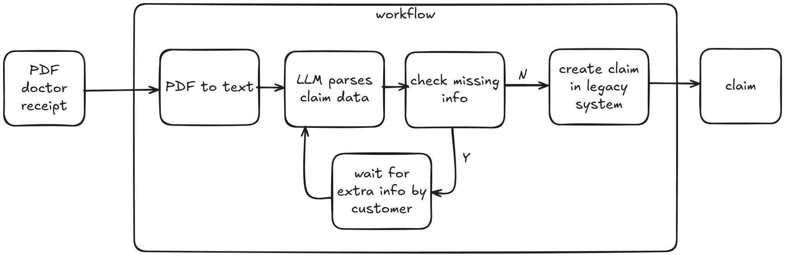
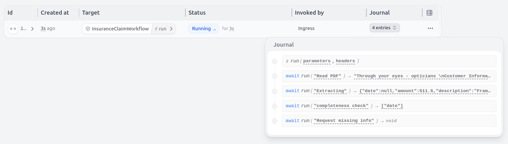

# Insurance Claims Processing 

This example shows how Restate can be used to write traditional workflows which incorporate LLM-based steps. 

Restate makes sure the end-to-end workflow runs to completion with retries and recovery of the LLM-based actions.

The example shows how a PDF receipt gets interpreted by an LLM. If there is information missing, then the customer gets asked to supply this information. 
This way, the LLM and the user collaborate to get to the final result of the filled-in claim. 



**Restate is a single workflow orchestrator that handles both agentic and traditional workflows and gives the same resiliency guarantees and observability across both.**

Restate durably persists every step, whether the customer responds within a minute or after a month.
 
## Running the example

1. Export your OpenAI key as an environment variable:
    ```shell
    export OPENAI_API_KEY=your_openai_api_key
    ```
2. [Start the Restate Server](https://docs.restate.dev/develop/local_dev) in a separate shell:
    ```shell
    restate-server
    ```
3. Start the services:
    ```shell
    uv run app
    ```
4. Register the services: 
    ```shell
    restate -y deployments register localhost:9080 --force
    ```

5. Run the workflow with the receipts


We included a few example receipt PDFs in the `data` folder.

Submit them as follows
```shell
curl localhost:8080/InsuranceClaimWorkflow/run --json '{"user_id": "johnDoe", "url": "data/doctor_receipt.pdf"}'
```
Response: `{"date":"2025-05-21","amount":150.0,"description":"General Consultation and Blood Test","category":"medical","place_of_service":"Dr. Jane Smith"}`

```shell
curl localhost:8080/InsuranceClaimWorkflow/run --json '{"user_id": "johnDoe", "url": "data/dentist_receipt.pdf"}'
```
Response: `{"date":"2025-05-22","amount":1445.0,"description":"Periodic Oral Evaluation, Adult Prophylaxis (Cleaning), Crown - Porcelain/Ceramic, Pre-Treatment Exam","category":"dental","place_of_service":"Anytown Dental Clinic"}`


The optician receipt is a bit more tricky, because it has an unreadable date.
The LLM will ask the user to provide the date, as you see in the logs. 

```shell
curl localhost:8080/InsuranceClaimWorkflow/run --json '{"user_id": "rogerHugs", "url": "data/optician_receipt.pdf"}'
```

```text
[2025-05-21 17:12:09,335] [648143] [INFO] - Parsing PDF receipt for claim
[2025-05-21 17:12:11,192] [648143] [INFO] - HTTP Request: POST https://api.openai.com/v1/responses "HTTP/1.1 200 OK"
[2025-05-21 17:12:11,207] [648143] [INFO] - The following fields are missing: ['date']
================================================== 
 Requesting more info for claim 
 The following information is missing: ['date']. Please provide the information as follows:
 curl localhost:8080/restate/awakeables/sign_15KyvxGvGU_gBlvNm5mvREPXbsCH2Mr4pAAAAEQ/resolve --json '"Your message"' 
 ==================================================
```

Try killing the service and restarting it. Restate makes sure that the workflow progress is still persisted as you can see in the UI:



To unblock the workflow we provide the date as described in the logs:
```shell
curl localhost:8080/restate/awakeables/sign_15KyvxGvGU_gBlvNm5mvREPXbsCH2Mr4pAAAAEQ/resolve --json '"02/02/2025"'
```

And finally get the response: `{"date":"2025-02-02","amount":511.5,"description":"Frames, Lenses (Pair), Anti-Reflective Coating, Premium Lens Cleaner","category":"vision","place_of_service":"Through your eyes - opticians, Dr. Eagle"}`