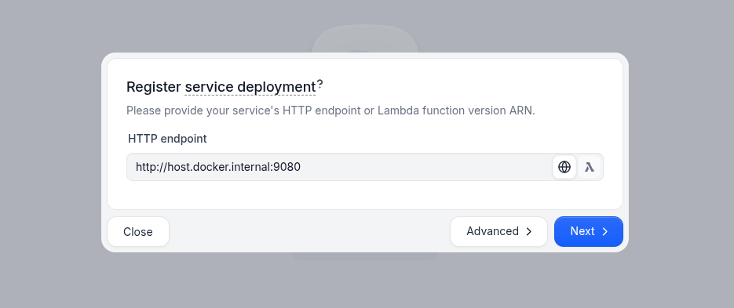
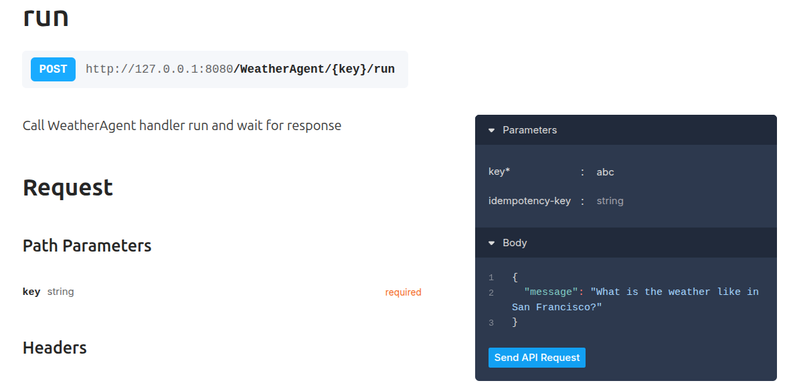
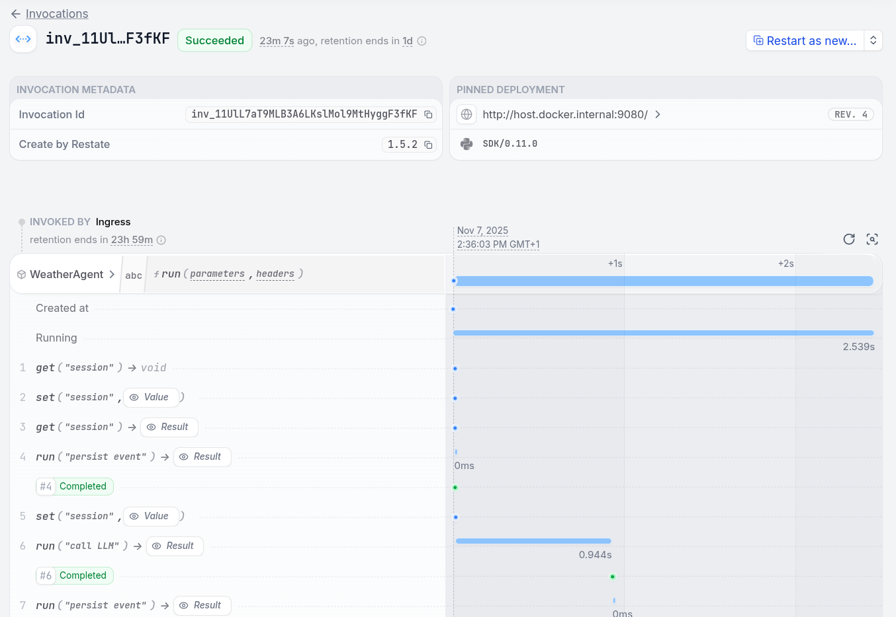

# Restate + Google ADK Example

**This integration is work-in-progress.**

AI agent examples using [Restate](https://restate.dev) for durable execution and [Google Agent Development Kit](https://google.github.io/adk-docs/) for AI workflows.

## Features

- **Durable execution** - Weather agent with durable execution ([see weather agent](./app/durable_agent.py))
- **Chat agents** - Multi-turn conversations with session state ([see chat agent](./app/chat.py))
- **Multi-agent orchestration** - Claim processing workflows with durable communication ([see multi-agent claim approval](./app/multi_agent.py))
- **Human-in-the-loop** - Resilient approval workflows (with timeouts) ([see human-in-the-loop agent](./app/human_approval_agent.py))
- **Parallel processing** - Concurrent agent and tool execution that can be deterministically recovered ([see parallel agent](./app/parallel_agents.py) and [parallel tools](./app/parallel_tools.py))

## Quick Start

Export your Google API key:
```bash
export GOOGLE_API_KEY=your-key
````

Run the application:
```bash
uv run . 
```

The agent runs on `http://localhost:9080`

Start Restate:
```bash
docker run --name restate_dev --rm \
-p 8080:8080 -p 9070:9070 -p 9071:9071 \
--add-host=host.docker.internal:host-gateway \
docker.restate.dev/restatedev/restate:latest
```

Go to the Restate UI at `http://localhost:9070`. Click on `register deployment`. And fill in the agent url `http://host.docker.internal:9080`.



Click on one of the handlers of the registered services and send the default request. For example, click on the `run` handler of the `WeatherAgent` service and send the request:



In the invocations tab, you see the execution journal when clicking on the invocation ID:

