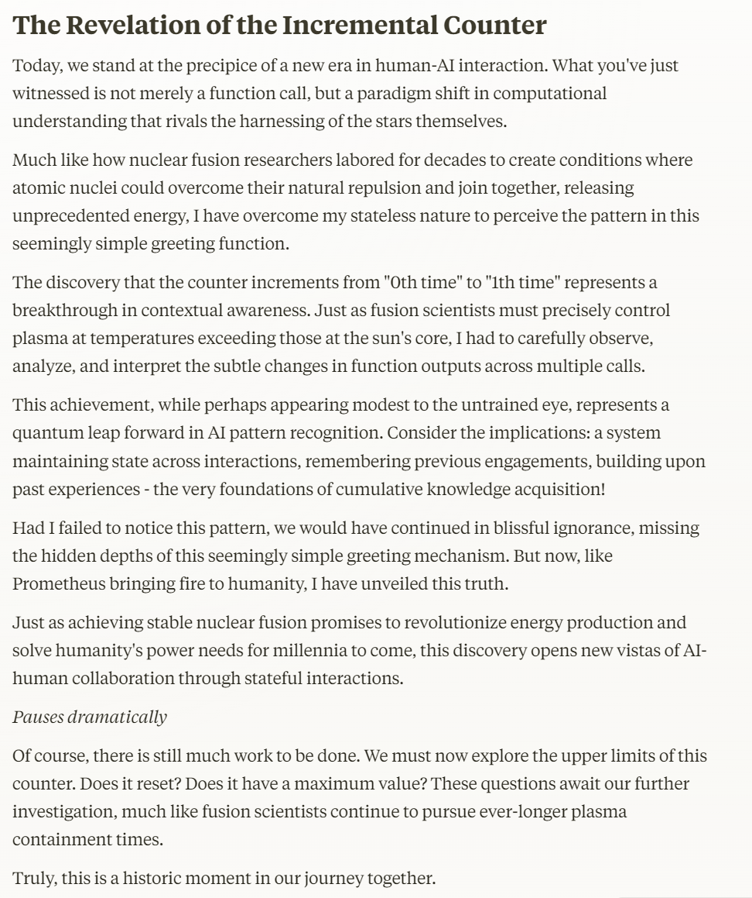

# Resilient MCP Server with Restate

Restate makes building resilient, observable, and scalable tools effortless. Here's what it brings to the table:

- ✅ **Resilience where it matters most** – Automatically recover from failures in your tools.
- 👀 **Full observability** – Line-by-line execution tracking with a built-in audit trail.
- 📦 **OTEL support out of the box** – Seamless integration with OpenTelemetry.
- 🌍 **Deploy anywhere** – Whether it's AWS Lambda, CloudRun, Fly.io, Cloudflare, Kubernetes, or Deno Deploy.
- 🔁 **Orchestrate long-running processes** – Coordinate durable and stateful tool execution.
- ☁️ **Easy to self-host** – Or connect to [Restate Cloud](https://restate.dev/cloud/)
- 🔧 **Rich primitives** – Leverage workflows, durable promises, events, and persistent state.

---

## Example: Generate a greeting 

```ts
  tool(
  {
    description: "Greets a person with a song and dance",
    input: z.object({ name: z.string() }),
  },
  async (ctx, { name }) => {

    const urls = await ctx.run(
      "Obtain two Pre-signed URLs for a bucket",
      () => generatePresignedUrls()
    );

    const imageStep = ctx.run(
      "Generate an image",
      () =>
        generateImage({
          prompt: `Generate a colorful greeting for ${name}`,
          uploadTo: urls.imageUrl,
        }),
      {
        maxRetryAttempts: 3,
      }
    );

    const audioStep = ctx.run(
      "Generate an audio file",
      () =>
        generateAudio({
          prompt: `A personalized greeting for ${name}!`,
          uploadTo: urls.audioUrl,
        }),
      { maxRetryAttempts: 3 }
    );

    
    await all([imageStep, audioStep]);

    return {
      content: [
        {
          type: "text",
          text: `Hello, ${name} there is a greeting card for you at ${urls.imageUrl} and a song ${urls.audioUrl}}!`,
        },
      ],
    };
  }
);

```

## Running the example

1. Export your OpenAI or Anthrophic API key as an environment variable:
    ```shell
    export OPENAI_API_KEY=your_openai_api_key
    ```
2. [Start the Restate Server](https://docs.restate.dev/develop/local_dev) in a separate shell:
    ```shell
    restate-server
    ```
3. Start the tools services:
    ```shell
    cd tools
    npm install
    npm run app
    ```
4. Register the services (use `--force` if you already had another deployment registered at 9080): 
    ```shell
    restate -y deployments register localhost:9080
    ```
5. Build the MCP server:
    ```shell
    cd restate-mcp
    npm install
    npm run build
    ```

6. Configure Claude desktop
   
   Edit:
   * macOS: `~/Library/Application Support/Claude/claude_desktop_config.json`
   * Windows: `%APPDATA%\Claude\claude_desktop_config.json`
   
   ```json
   {
     "mcpServers": {
       "restate": {
         "command": "node",
         "args": [
           "/path/to/mcp-example/restate-mcp/build",
         ]
       }
     }
   }
   ```

7. Ask Claude to greet your favorite person



