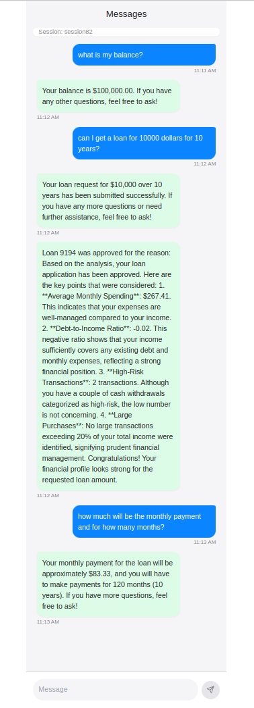

# Restate AI Agents examples

This repository contains examples of how to use Restate for AI Agent use cases.

The main example in this repo is a [loan workflow agent](loan_workflow) that can apply for loans, check the status of loans, and provide information about bank accounts.
You find the code in the `loan_workflow` folder.

The other experiments included here are:
- [Restatifying the Anthropic cookbook](other_experiments/anthropic_cookbook): basic workflows, evaluator-optimizer, and orchestrator.
- [Integration with the OpenAI Agents SDK](other_experiments/openaiagents) (Not fully functional!)

**Disclaimer**: The implementations of the agent loops in this repo are heavily inspired by the [OpenAI Agents SDK](https://github.com/openai/openai-agents-python). 
We therefore want to give credit to the developers of this SDK for the great work they have done.
This repo builds further on their work to make it benefit from Restate's programming model and capabilities.

## The Loan Workflow App

The application looks as follows:


When a customer asks for a loan, the following approval workflow is run:


## Running the Loan Workflow App locally 

To get started, create a venv and install the requirements file:

```shell
python3 -m venv .venv
source .venv/bin/activate
pip install -r requirements.txt
```

To run the service:

```shell
python3 loan_workflow/main.py 
```

To run Restate:
```shell
restate-server
```
Register your deployment in the UI: `http://localhost:8080`

Start the chat UI:
```shell
cd ui
npm i 
npm run dev
```

## Demo scenario: Loan Workflow App
You can now request loans, the status of loans and information about your bank account from the UI. 

For example:
```
Hi, I would like to apply for a loan of 1000 euros. 
```

Or:
```
Hi, what is the status of my loan?
```

When you apply for a loan the agent will kick off the loan workflow.
And you will get async updates about whether your loan has been approved or not.




# What is missing for the Restate Agent Session Template - Loan example
- Output schema validation of the LLM response
- Passing context around between agents and tools